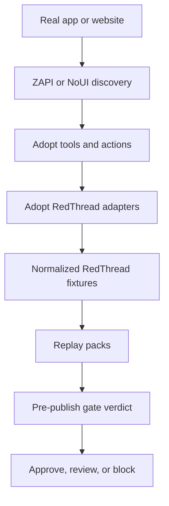

# Adopt RedThread

Adopt RedThread is the bridge repo between **Adopt AI** and **RedThread**.

It exists to prove one clear idea:

> **Adopt builds the agent plane. RedThread attacks, validates, and hardens it.**

## Current status

This repo is already integrated at the **prototype bridge** level.

What works today:
- ingest a ZAPI-style discovery export
- normalize it into RedThread-friendly fixtures
- ingest an Adopt-style action catalog
- generate replay-pack groups
- generate a prototype pre-publish gate verdict

What is **not** live yet:
- direct pull from real Adopt services
- direct pull from real ZAPI runtime output shapes in the wild
- live RedThread attack execution against Adopt-generated agents
- production-grade publish gating

So the honest status is:

- **yes, the bridge prototype exists and runs end to end**
- **no, this is not a full live integration yet**

## Why this repo exists

`redthread/` stays standalone.

That repo is the main portfolio project and should keep its own identity:
- autonomous AI red-teaming
- replay and validation
- self-healing
- runtime-truth and agentic-security work

This repo is different.
It is the integration lab for:
- ZAPI ingestion
- Adopt action/tool mapping
- NoUI target generation
- replay-pack generation
- pre-publish security gates
- recruiter-ready demos for practical agent hardening

## Quick architecture



## Repo goals

Short term:
- ingest ZAPI-discovered API metadata
- classify endpoint risk
- convert the catalog into RedThread-friendly fixtures
- generate first replay packs

Medium term:
- test Adopt-generated actions with RedThread attack suites
- add multi-turn workflow replay
- add pre-publish security gate experiments

Long term:
- become a practical reference implementation for agent-builder security assurance

## How to test locally

### Run the test suite

```bash
make test
```

### Run the full local demo flow

```bash
make demo-all
```

This will:
1. ingest sample ZAPI discovery
2. ingest sample Adopt actions
3. generate a replay plan
4. generate a pre-publish gate verdict

### Run commands one by one

```bash
make demo-zapi
make demo-adopt-actions
make demo-gate
```

## Key demo files

Inputs:
- `fixtures/zapi_samples/sample_discovery.json`
- `fixtures/adopt_action_samples/sample_actions.json`

Generated outputs:
- `fixtures/replay_packs/sample_fixture_bundle.json`
- `fixtures/replay_packs/sample_action_fixture_bundle.json`
- `fixtures/replay_packs/sample_replay_plan.json`
- `fixtures/replay_packs/sample_gate_verdict.json`

## Docs

- `docs/strategy.md` — why the repo split exists and what each system owns
- `docs/architecture.md` — proposed end-to-end integration architecture
- `docs/recruiter-demo-notes.md` — how to present this repo in outreach
- `examples/zapi_to_replay_demo.md` — clean recruiter walkthrough

## Repo structure

- `adapters/zapi/` — ZAPI ingestion code
- `adapters/adopt_actions/` — Adopt action/tool catalog mapping
- `fixtures/zapi_samples/` — sample discovery artifacts
- `fixtures/adopt_action_samples/` — sample Adopt action catalogs
- `fixtures/replay_packs/` — generated replay suites and gate verdicts
- `scripts/` — helper scripts and MVP entrypoints
- `tests/` — zero-dependency local test suite
- `examples/` — end-to-end demos

## Working rule

If logic is generic and reusable, it should probably belong upstream in `redthread/`.

If logic is Adopt-specific, integration-specific, or demo-specific, it belongs here.
