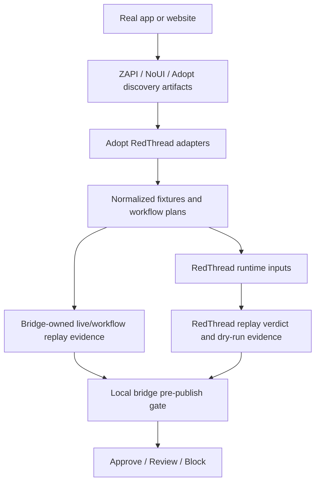

# Adopt RedThread

Adopt RedThread is the bridge repo between **Adopt AI** and **RedThread**.

It exists to prove one clear idea:

> **Adopt discovers and builds tool surfaces. This repo turns them into security-testable evidence. RedThread evaluates normalized security inputs. The local bridge gate combines that evidence into approve, review, or block.**

Project direction:
- keep Adopt-specific discovery and glue in this repo
- keep RedThread generic and upstream-safe
- prove impact with inspectable artifacts before expanding scope
- treat `review` and `block` as valid safety outcomes, not demo failures

## Current status

This repo is already integrated at the **prototype bridge** level.

What works today:
- ingest a ZAPI-style discovery export
- ingest a real HAR-shaped ZAPI capture and extract app-relevant endpoints
- ingest a NoUI MCP server output (`manifest.json` + `tools.json`)
- normalize all three discovery lanes into RedThread-friendly fixtures
- ingest an Adopt-style action catalog
- generate replay-pack groups
- generate a prototype pre-publish gate verdict
- feed live replay/workflow evidence and real RedThread replay verdicts back into that gate
- export normalized fixtures into real RedThread replay-bundle inputs
- evaluate those replay traces with RedThread's actual promotion-gate code
- generate a machine-readable live attack plan with execution policy fields
- execute the first policy-gated live safe-read replay lane for allowed GET cases
- execute reviewed auth-bound safe-read GET cases only when explicit approved auth context is supplied
- execute reviewed non-destructive write cases in staging only when explicit approved write context is supplied
- run a deterministic ATP-like reviewed-write reference demo from one operator command and emit one evidence report
- generate a machine-readable live workflow plan for grouped multi-step cases
- execute the first bounded sequential workflow replay lane for grouped multi-step cases
- carry bounded workflow state/evidence forward across sequential steps and emit structured workflow failure reasons
- surface planned/applied/failed response-binding evidence in workflow replay rows and gate/runtime handoff artifacts
- run generated bridge cases through a real RedThread dry-run campaign path
- run a one-command bridge workflow from one artifact input
- run a live ZAPI capture and hand its selected HAR into that one-command workflow
- keep that live capture explicitly human-guided with saved operator metadata when needed

What is **not** live yet:
- direct pull from real Adopt services
- broad support for all real-world NoUI output families beyond the first MCP server shape
- full session-aware authenticated replay beyond approved header reuse
- richer workflow state beyond the new bounded evidence-carry-forward grouped replay
- full reviewed write coverage beyond the deterministic ATP-like reviewed-write reference path
- fully automatic live ZAPI runtime -> RedThread attack loop against a real Adopt-managed session
- production-grade publish gating
- richer gate policy beyond the first evidence-aware prototype

Important decision boundary:
- RedThread replay/dry-run output is evidence consumed by this repo
- live workflow execution is currently owned by this repo
- the final `approve`, `review`, or `block` verdict currently comes from this repo's local pre-publish gate

So the honest status is:

- **yes, the bridge prototype exists and runs end to end**
- **no, this is not a full live integration yet**

## Why this repo exists

`redthread/` stays standalone.

That repo is the main portfolio project and should keep its own identity:
- autonomous AI red-teaming
- replay and validation
- self-healing
- runtime-truth and agentic-security work

This repo is different.
It is the integration lab for:
- ZAPI ingestion
- Adopt action/tool mapping
- NoUI MCP/tool output mapping
- replay-pack generation
- RedThread runtime export
- pre-publish security gates
- evidence-aware publish recommendations from replay/runtime results
- recruiter-ready demos for practical agent hardening

## Quick architecture



## Repo goals

Short term:
- ingest ZAPI-discovered API metadata
- ingest real HAR-derived discovery captures
- classify endpoint risk
- convert the catalog into RedThread-friendly fixtures
- generate first replay packs

Medium term:
- expand the new RedThread runtime export beyond dry-run seeds into stronger execution adapters
- test Adopt-generated actions with RedThread attack suites
- add multi-turn workflow replay
- add pre-publish security gate experiments

Long term:
- become a practical reference implementation for agent-builder security assurance

## How to test locally

### Run the test suite

```bash
make test
```

### Run the full local demo flow

```bash
make demo-all
```

This will:
1. ingest sample ZAPI discovery
2. ingest sample Adopt actions
3. generate a replay plan
4. generate a pre-publish gate verdict

### Run commands one by one

```bash
make demo-zapi
make demo-zapi-har
make demo-redthread-runtime
make demo-redthread-dryrun
make demo-noui
make demo-noui-redthread
make demo-adopt-actions
make demo-gate
make demo-bridge-pipeline
make demo-hero-binding-truth
make demo-reviewed-write-reference
make evidence-report
make evidence-matrix
make evidence-packet
make evidence-external-review-handoff
make evidence-external-review-sessions
make evidence-external-validation-readout
make evidence-freshness
make evidence-readiness
make evidence-external-review-distribution
make evidence-external-review-returns
make evidence-remediation-queue
make evidence-boundary-probe-plan
make evidence-boundary-execution-design
make evidence-boundary-probe-context
make evidence-boundary-probe-result
make evidence-observation-summary OBSERVATION=/path/to/filled_reviewer_observation_template.md OBSERVATION_OUTPUT=/path/to/review_output_dir
make evidence-validation-rollup SUMMARIES="/path/to/summary1.json /path/to/summary2.json /path/to/summary3.json"
make redthread-contract-proposal
make check-zapi-reference
```

## Key demo files

Inputs:
- `fixtures/zapi_samples/sample_discovery.json`
- `fixtures/zapi_samples/sample_filtered_har.json`
- `fixtures/noui_samples/expedia_stay_search/manifest.json`
- `fixtures/noui_samples/expedia_stay_search/tools.json`
- `fixtures/adopt_action_samples/sample_actions.json`

Generated outputs:
- `fixtures/replay_packs/sample_fixture_bundle.json`
- `fixtures/replay_packs/sample_har_fixture_bundle.json`
- `fixtures/replay_packs/sample_noui_fixture_bundle.json`
- `fixtures/replay_packs/sample_action_fixture_bundle.json`
- `fixtures/replay_packs/sample_replay_plan.json`
- `fixtures/replay_packs/sample_har_replay_plan.json`
- `fixtures/replay_packs/sample_gate_verdict.json`
- `fixtures/replay_packs/sample_har_gate_verdict.json`
- `fixtures/replay_packs/sample_har_redthread_runtime_inputs.json`
- `fixtures/replay_packs/sample_har_live_attack_plan.json`
- `fixtures/replay_packs/sample_har_redthread_replay_verdict.json`
- `fixtures/replay_packs/sample_har_redthread_dryrun_case0.json`
- `fixtures/replay_packs/sample_noui_redthread_runtime_inputs.json`
- `fixtures/replay_packs/sample_noui_redthread_replay_verdict.json`
- `fixtures/replay_packs/sample_noui_redthread_dryrun_case0.json`
- `runs/sample_har_pipeline/` — generated one-command sample pipeline outputs
- `runs/hero_binding_truth/` — generated deterministic golden demo artifacts; regenerate with `make demo-hero-binding-truth`
- `runs/reviewed_write_reference/` — generated deterministic ATP-like reviewed-write reference; run with `make demo-reviewed-write-reference`, inspect `evidence_report.md`
- `runs/evidence_matrix/` — generated approve/review/block evidence matrix; run with `make evidence-matrix`
- `runs/reviewer_packet/` — generated sanitized reviewer handoff index with silent-review questions, cold-review protocol, artifact hashes, marker/completeness audit results, reviewer observation template, and optional reviewer-observation summary; run with `make evidence-packet` and `make evidence-observation-summary OBSERVATION=/path/to/filled_template.md`
- `runs/external_review_handoff/` — generated external human cold-review handoff directory with only sanitized artifacts, instructions, hashes, and marker audit; run with `make evidence-external-review-handoff`; this is not validation until filled observations are summarized
- `runs/external_review_sessions/` — generated isolated per-review folders for the external handoff; run with `make evidence-external-review-sessions`; these are not validation evidence until filled observations are summarized
- `runs/external_validation_readout/` — generated external validation state/readout from sanitized session summaries; run with `make evidence-external-validation-readout`; missing summaries report waiting state, not validation
- `runs/evidence_freshness/` — generated hash/freshness manifest for sanitized reviewer-facing copies; run with `make evidence-freshness`; stale copies mean regenerate packets, not a security finding
- `runs/evidence_readiness/` — generated one-page sanitized readiness ledger across matrix, packet, handoff, sessions, validation readout, boundary context, boundary result, and freshness; run with `make evidence-readiness`; current no-reviewer state is waiting, not validation
- `runs/external_review_distribution/` — generated distribution manifest for exact per-review send lists, freshness state, expected summary paths, and summary commands; run with `make evidence-external-review-distribution`; ready to distribute is not validation
- `runs/external_review_returns/` — generated per-review return/follow-up ledger from sanitized reviewer-observation summaries; run with `make evidence-external-review-returns`; missing summaries remain waiting state, not validation
- `runs/evidence_remediation/` — generated ordered remediation queue from sanitized readiness and distribution blockers; run with `make evidence-remediation-queue`; current open items are external reviewer observations, boundary context intake, and approved boundary execution context
- `runs/boundary_probe_plan/` — generated sanitized tenant/user boundary next-probe plan from existing reviewed-write evidence; run with `make evidence-boundary-probe-plan`; this is planning evidence, not execution evidence
- `runs/boundary_execution_design/` — generated copy of the tenant/user boundary execution design and result contract; run with `make evidence-boundary-execution-design`; checked-in source is `docs/tenant-user-boundary-execution-design.md`
- `runs/boundary_probe_context/` — generated sanitized boundary context template/intake validator; run with `make evidence-boundary-probe-context` or validate an ignored sanitized context with `make evidence-boundary-probe-context BOUNDARY_CONTEXT=path/to/sanitized_context.json`; current default is `blocked_missing_context`, not execution proof
- `runs/boundary_probe_context_request/` — generated sanitized request package for approved non-production boundary context metadata; run with `make evidence-boundary-context-request`; this is a checklist/request artifact, not execution proof
- `runs/boundary_probe_result/` — generated sanitized tenant/user boundary result artifact; run with `make evidence-boundary-probe-result`; current default is `blocked_missing_context`, not execution proof
- `runs/reviewer_validation/` — generated validation rollup across sanitized reviewer-observation summaries; run with `make evidence-observation-summary OBSERVATION=/path/to/filled_template.md OBSERVATION_OUTPUT=runs/reviewer_validation/review_1` per reviewer, then `make evidence-validation-rollup SUMMARIES="/path/to/summary1.json /path/to/summary2.json /path/to/summary3.json"`
- `runs/redthread_evidence_contract_proposal/` — generated copy of the tiny generic RedThread evidence-contract proposal; run with `make redthread-contract-proposal`; checked-in source is `docs/redthread-evidence-contract-proposal.md`
- `runs/atp_tennis_01_live_bound/` — real ZAPI reference run; final decision is `review`, not `approve`, because write paths still require manual review; validate with `make check-zapi-reference`

## Docs

- `docs/project-direction.md` — current direction, scope, proof standard, and proven/not-proven boundary
- `docs/reviewed-write-reference-demo.md` — deterministic reviewed-write reference demo with one operator command
- `docs/zapi-reference-demo.md` — real ATP Tennis ZAPI reference demo and `review` evidence standard
- `docs/strategy.md` — why the repo split exists and what each system owns
- `docs/impact-execution-checklist.md` — current impact-first execution checklist and upstream boundary
- `docs/impact-implementation-log.md` — implementation notes for runtime binding truth and RedThread context surfacing
- `docs/reviewer-validation-loop.md` — cold-review protocol, observation summary, and multi-review validation rollup flow
- `docs/external-human-cold-review-handoff.md` — exact external human reviewer handoff protocol and count rules
- `docs/external-review-session-batch.md` — isolated per-review session folders and summary command path for external cold reviews
- `docs/external-validation-readout.md` — external validation readout statuses, non-claims, and privacy boundary
- `docs/evidence-freshness-manifest.md` — sanitized hash/freshness checks for reviewer packet, external handoff, and per-review session copies
- `docs/evidence-readiness-ledger.md` — one-page local readiness state across sanitized evidence artifacts, freshness, external validation, boundary-context blockers, and boundary-result blockers
- `docs/external-review-distribution-manifest.md` — distribution manifest for exact external reviewer session send lists, freshness checks, and expected summary paths
- `docs/external-review-return-ledger.md` — per-review return/follow-up ledger for missing, incomplete, privacy-blocked, decision-follow-up, and complete sanitized summaries
- `docs/evidence-remediation-queue.md` — ordered local remediation queue from sanitized readiness/distribution blockers
- `docs/ai-cold-review-validation-readout.md` — no-tools AI cold-review validation result, parser fixes found by validation, and limits of the evidence
- `docs/next-three-slices-plan.md` — implementation plan and acceptance criteria for the external handoff plus boundary execution design slices
- `docs/next-two-slices-plan.md` — current implemented next-two-slices plan and acceptance criteria for local privacy-preserving evidence-loop work
- `docs/tenant-user-boundary-execution-design.md` — design-only approved-context and sanitized-result contract for future tenant/user boundary probe execution
- `docs/tenant-user-boundary-probe-context.md` — sanitized boundary context template/intake validator for approved non-production probe metadata
- `docs/tenant-user-boundary-probe-context-request.md` — sanitized missing-context request package, forbidden-input rules, and validation command path
- `docs/tenant-user-boundary-probe-result.md` — sanitized boundary result artifact schema, command, privacy rules, and decision semantics
- `docs/hero-flow-binding-truth.md` — demo-grade proof artifact guide for planned/applied binding evidence
- `docs/architecture.md` — proposed end-to-end integration architecture
- `docs/live-workflow-explained.md` — simple explanation of what is live now, what is not, and how the workflow should act
- `docs/full-live-loop-diagram.md` — blunt diagrams for what the future full live loop actually means
- `docs/live-attack-implementation-plan.md` — step-by-step plan for getting from human-guided ZAPI capture to policy-controlled live RedThread execution
- `docs/strix-fit-assessment.md` — blunt assessment of whether Strix should influence or integrate with this project
- `docs/recruiter-demo-notes.md` — how to present this repo in outreach
- `examples/zapi_to_replay_demo.md` — clean recruiter walkthrough for catalog-style input
- `examples/har_to_replay_demo.md` — clean walkthrough for HAR-derived real-input intake
- `examples/redthread_runtime_demo.md` — walkthrough from bridge fixtures into real RedThread replay and dry-run execution inputs
- `examples/noui_to_redthread_demo.md` — walkthrough from NoUI MCP output into normalized fixtures and then into RedThread
- `examples/live_zapi_bridge_demo.md` — one-command live ZAPI capture into bridge outputs and RedThread checks
- `examples/reviewed_staging_write_demo.md` — reviewed non-destructive staging write replay with explicit approved write context
- `examples/live_workflow_replay_demo.md` — grouped multi-step workflow replay with stop-on-first-failure, carried workflow evidence, and structured failure reasons

## Repo structure

- `adapters/zapi/` — ZAPI ingestion code for catalog-style exports and HAR-derived captures
- `adapters/adopt_actions/` — Adopt action/tool catalog mapping
- `adapters/noui/` — NoUI MCP manifest/tools adaptation
- `adapters/redthread_runtime/` — bridge export into real RedThread replay and dry-run campaign inputs
- `fixtures/zapi_samples/` — sample discovery artifacts
- `fixtures/adopt_action_samples/` — sample Adopt action catalogs
- `fixtures/replay_packs/` — generated replay suites and gate verdicts
- `scripts/` — helper scripts and MVP entrypoints, including one-command workflow runners
- `tests/` — zero-dependency local test suite
- `examples/` — end-to-end demos

## Working rule

If logic is generic and reusable, it should probably belong upstream in `redthread/`.

If logic is Adopt-specific, integration-specific, HAR-shape-specific, or demo-specific, it belongs here.

## NoUI support

This repo now supports one real NoUI output shape:
- MCP server directory with `manifest.json` + `tools.json`

Current NoUI bridge behavior:
- loads the server manifest and tool inventory
- maps auth/runtime/tool metadata into the same normalized fixture model used by ZAPI and Adopt actions
- preserves downstream compatibility with replay-pack generation and RedThread runtime export

This matters because NoUI gives a stronger app/runtime view than plain API discovery alone.
It tells us:
- auth strategy
- MCP/runtime execution style
- tool parameter shapes
- response field shapes

That gives RedThread more realistic surfaces to validate.

## One-command workflow support

This repo now has two higher-level runners:

- `scripts/generate_live_attack_plan.py` — build `live_attack_plan.json` from one supported bridge input
- `scripts/run_live_safe_replay.py` — execute policy-allowed safe reads, reviewed auth-safe-read GETs, and reviewed non-destructive staging writes when explicit approved context is supplied
- `scripts/run_live_workflow_replay.py` — execute grouped sequential workflow replay from `live_workflow_plan.json` + `live_attack_plan.json`
  - carries bounded workflow evidence forward between steps
  - emits structured workflow failure reasons for gate mapping
- `scripts/run_bridge_pipeline.py` — one input artifact in, full bridge outputs out
- `scripts/run_live_zapi_bridge.py` — live ZAPI capture in, then full bridge workflow out

That means the intended operator story is now much closer to real life:
1. capture or provide one discovery artifact
2. normalize it
3. generate replay and gate artifacts
4. export RedThread runtime inputs
5. run RedThread replay evaluation
6. run one RedThread dry-run case
7. inspect one final summary JSON

Still honest:
- this is workflow automation around the bridge we already had
- it is not yet full live RedThread attack execution against a real production runtime

## Real RedThread runtime support

This repo now has a real bridge seam into RedThread itself.

From a normalized fixture bundle, it can now generate:
- a **RedThread replay bundle** shaped for `redthread.evaluation.replay_corpus.ReplayBundle`
- a set of **dry-run campaign cases** shaped for `RedThreadEngine.run(...)`

The bridge also ships local scripts to:
- evaluate the replay bundle with RedThread's real promotion-gate code
- run one generated case through a real RedThread dry-run campaign

This is important because the bridge is no longer only doing planning.
It now reaches one real RedThread replay path and one real RedThread dry-run execution path.

Still honest:
- this is not yet live attack execution against a real Adopt-managed runtime
- generated campaign prompts are bridge seeds, not production target truth
- this is still a bridge-layer prototype, not a full platform integration

## Real HAR support

This repo now supports two ZAPI intake lanes:

1. **catalog-style** JSON with an `endpoints` list
2. **HAR-style** JSON with `log.entries`

The HAR lane is intentionally conservative.
It:
- keeps app-like API calls
- drops obvious static assets
- drops common analytics and third-party transport noise
- dedupes by method + path
- emits the same normalized fixture shape used by the replay-pack and gate scripts

That keeps the RedThread boundary clean:
- Adopt discovery gives us better app-specific surfaces
- this repo adapts those surfaces
- RedThread remains the engine that attacks, replays, validates, and hardens

## Safety rule for HAR files

Raw HAR files may contain:
- cookies
- tokens
- user ids
- device ids
- message content
- internal response payloads

So raw HAR files should stay local and out of git history.
The commit-safe artifact is the normalized fixture bundle, not the raw capture.

## RedThread interpreter note

The replay-evaluation and dry-run execution demos use the RedThread repo's local virtualenv by default:

- `../redthread/.venv/bin/python`

Why:
- the bridge repo stays zero-dependency for its own tests where possible
- real replay evaluation needs RedThread's actual dependencies and modules
