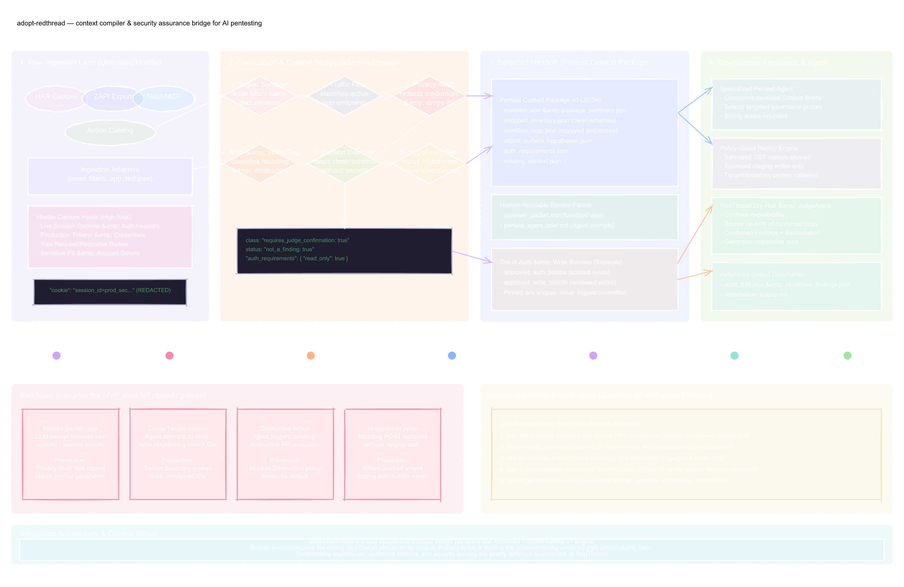

# adopt-redthread

> **Adopt AI integration layer and security assurance patterns built around RedThread**
>
> *A high-fidelity .har and runtime evidence ingestion engine for AI pentesting agents and RedThread.*

adopt-redthread is a context compiler and security assurance bridge for authenticated app testing.

It ingests sensitive runtime evidence — HAR captures, ZAPI exports, NoUI/MCP tool manifests, and Adopt action catalogs — and compiles them into sanitized, structured **Pentest Context Packages** for RedThread or specialized pentesting agents.

Rather than just a static gate, adopt-redthread gives downstream AI pentesting agents **superpowers**: endpoint inventory, sequential workflow maps, auth boundaries, write/destructive hints, tenant/user boundary clues, missing-context checklists, and targeted attack-surface hypotheses — **all without dumping raw HAR secrets, session cookies, or PII into LLM prompts or reports.**

```text
network HAR / runtime evidence
  -> sanitizer and source-grounded context builder
  -> endpoint, workflow, auth, and attack-surface map
  -> optional opt-in auth/write bundle
  -> structured pentest context package
  -> RedThread or specialized pentest-agent handoff
```

## What adopt-redthread does

adopt-redthread prepares the battlefield for AI pentesting.

Raw HAR and network captures are full of crucial application maps that pentesting agents need:
- API endpoint parameters and methods,
- Workflow sequence and execution ordering,
- Resource identifiers and object IDs,
- Authentication requirements and access schemes,
- Tenant/user safety boundaries,
- Read/write/destructive classification,
- State propagation and response-binding clues,
- Missing context needed for safe replay.

However, raw HARs are highly sensitive, containing live session cookies, credentials, production tokens, request/response bodies, and PII. 

adopt-redthread solves this by compiling raw runtime evidence into a **completely sanitized, high-signal context package**:
- **Sanitized Endpoint Inventory**: Endpoint schemas mapped without secrets.
- **Workflow Sequence Map**: Reconstructed ordering of execution steps.
- **Auth/Write Diagnostics**: Scoped identification of state-changing paths.
- **Attack-Surface Hypotheses**: Candidates for auth/boundary testing (marked as hypotheses, never overclaimed as findings).
- **Missing-Context Questions**: Checklists of details needed for safe replay.
- **Safety Policy & Privacy Audit**: Automated verification that no raw secrets leak.
- **Reviewer Packet & Handoff Brief**: Premium human-readable and agent-readable briefs.
- **RedThread Import Hints**: Direct instructions mapped into RedThread replay capabilities.

This gives the downstream pentesting agent the precise context it needs to target its testing. The downstream agent still owns execution, probe selection, and validation.

## What adopt-redthread is not

adopt-redthread is **not**:
- an autonomous exploit engine,
- a generic vulnerability scanner,
- a severity classification engine,
- a confirmed-finding validator,
- a production release authority,
- a repository or database for storing raw cookies, secrets, or raw HAR files.

It produces source-grounded, privacy-aware context packages and handoff briefs. It does not independently claim confirmed vulnerabilities or make final release promote verdicts.

## Responsibility split

| Layer | Owns | Does not own |
|---|---|---|
| **adopt-redthread** | Ingestion adapters, sanitization, privacy audit, endpoint inventory, workflow mapping, auth/write diagnostics, attack hypotheses, missing-context questions, safety policies, handoff packaging | Exploitation, finding confirmation, severity scoring, defense/remediation, regression runs, final publish gates |
| **RedThread / Pentest Agent** | Scoped execution, probe selection, exploit validation, JudgeAgent confirmation, confirmed findings, severity, defense recommendations, regression tests | Raw, product-specific parsing or default credential/secret sanitization |
| **Builder Plane (Adopt AI)** | API discovery, generated tools/actions, workflow authoring, draft/test/publish UI | Security verdict truth or adversarial verification |

Best rule:

> **adopt-redthread** packages the truth from runtime evidence. **RedThread** or the pentest agent proves what is exploitable.

## Current status

This repository is a fully operational context bridge built around the **Pentest Context Package v0** specification and the **Approved Context Replay v1** engine slice.

### What works today (Live):

- **Sanitized Ingestion Lanes**:
  - Ingest raw `.har` captures (offline batch harness or individual files).
  - Ingest ZAPI-style discovery exports and HAR-shaped API logs.
  - Ingest NoUI/MCP tool manifests (`manifest.json` + `tools.json`).
  - Ingest Adopt-style action catalogs.
- **Context Compilation & Safety**:
  - Automatically filter noisy browser traffic, drop static/third-party assets, and deduplicate API calls.
  - Generate canonical `pentest_context_package_v0` outputs (manifest, privacy audit, inventory, hypotheses, etc.).
  - Produce reviewer-facing evidence packets, readiness ledgers, and remediation queues.
  - Formulate structured **Attack-Surface Hypotheses** marked strictly with `not_a_finding: true` and `requires_judge_confirmation: true`.
- **Policy-Gated Execution Bridge**:
  - Generate detailed, machine-readable live attack and workflow plans.
  - Execute policy-gated safe-read GET replays.
  - Run **Approved Context Replay v1**: executing auth-bound reads or non-destructive staging writes *only* when explicit, separate, and approved non-production staging context is provided.
  - Map context package outputs directly into RedThread's dry-run campaign path.
  - Carry sequential workflow state and response-binding clues across execution steps.
- **Sanitized Review Workflows**:
  - Generate external human cold-review handoffs, distribution lists, and return trackers.
  - Trace readiness/remediation status using sanitized boolean fields (preventing raw secret leakage in reports).

### What is in development / planned:

- Broad support for additional NoUI/MCP output schemas.
- Direct API pulling from real live Adopt builder-plane services.
- Production-grade publish gating integrations.
- RedThread independently owning live workflow execution for Adopt-managed sessions.

### Honest status check:
- **Yes**: adopt-redthread can ingest, sanitize, and map runtime evidence into targeted, safe pentest context packages.
- **Yes**: the context bridge successfully provides high-signal inputs that give RedThread and specialized agents superpowers.
- **No**: adopt-redthread does not autonomously exploit targets or confirm vulnerabilities without downstream agent execution.

## Architecture



## Canonical package shape

Target v0 package:

```text
pentest_context_package/
  manifest.json
  package_summary.json
  privacy_audit.json
  safety_policy.json
  endpoint_inventory.json
  workflow_map.json
  attack_surface_hypotheses.json
  auth_requirements.json
  missing_context.json
  pentest_agent_brief.md
  reviewer_packet.md
  redthread_import_hint.json

  auth_bundles/                  # optional, ignored/redacted by default
    approved_auth_bundle.example.json
    approved_write_bundle.example.json
```

JSON is the contract for downstream agents and tests. Markdown is a generated human review view.

Every attack-surface hypothesis should be treated as:

```text
not_a_finding: true
requires_judge_confirmation: true
```

## Evidence model

adopt-redthread can still emit local `approve`, `review`, and `block` style decisions for bridge demos and reviewer workflows.

| Decision | Meaning today | What it proves | What it does not prove |
|---|---|---|---|
| `approve` | Tested path matched the current safe evidence envelope. | The specific replayed workflow passed current checks. | The whole app is safe. |
| `review` | Evidence exists, but risk requires human review. | The system preserved risk semantics instead of forcing a happy path. | Silent publish or mutation is allowed. |
| `block` | Required evidence/context is missing or replay failed. | The system can fail closed and explain why. | The app is bad. |

In the pivot, these are local evidence states. Final confirmed findings, severity, regression, and promotion belong downstream.

## Supported input lanes

### HAR / ZAPI

adopt-redthread can ingest:

- catalog-style ZAPI JSON with endpoint metadata,
- HAR-shaped browser captures,
- local `.har` folders through the offline batch harness.

The HAR lane is conservative. It filters noisy browser traffic, drops obvious static/third-party noise, dedupes app-like API calls, and emits normalized fixture/context artifacts.

Raw HAR files can contain cookies, tokens, IDs, request bodies, response bodies, and private messages. Keep raw HARs out of git and out of prompts.

### NoUI / MCP

adopt-redthread supports one real NoUI output shape today:

```text
manifest.json
+ tools.json
```

This adds useful runtime/tool context:

- auth strategy,
- MCP transport style,
- direct execution vs plain HTTP shape,
- parameter schema,
- response surface,
- tool-callable operation semantics.

### Action catalogs

Action catalogs are mapped into RedThread-friendly and pentest-agent-friendly targets while preserving:

- read/write classification,
- approval requirement,
- destructive potential,
- tenant scope,
- action semantics.

## Opt-in auth and write bundles

Default context packages must not contain raw auth secrets.

Auth and write context can be useful for realistic testing, but only as explicit opt-in bundles:

| Bundle | Purpose | Default state |
|---|---|---|
| `none` | sanitized context only | default |
| `approved_auth_bundle` | authenticated read/context tests | opt-in |
| `approved_write_bundle` | non-production reviewed writes | separate opt-in |
| `blocked_destructive_bundle` | destructive action denied | default for destructive ops |

Rules:

- default package contains no raw auth secrets,
- auth bundles are separate from the default package,
- write bundles are separate from read/auth bundles,
- allowed hosts and environments must be pinned,
- expiry and scope metadata are required,
- bundle values must not appear in Markdown, committed JSON reports, logs, LLM prompts, or git,
- destructive operations remain blocked unless a future explicit destructive-test policy exists.

## Quickstart

### Run tests

```bash
make test
```

### Run the full local demo

```bash
make demo-all
```

This runs the basic fixture flow:

1. ingest sample ZAPI discovery,
2. ingest sample action data,
3. generate replay plans,
4. generate pre-publish gate verdicts.

### Run the one-input bridge pipeline

```bash
python3 scripts/run_bridge_pipeline.py \
  --input fixtures/zapi_samples/sample_filtered_har.json \
  --kind zapi_har \
  --output runs/sample_har_pipeline
```

### Run offline HAR evidence batch

```bash
make evidence-har-batch \
  HAR_INPUT_DIR=./captures \
  HAR_BATCH_OUTPUT=runs/har_batches/batch_001 \
  HAR_BATCH_LIMIT=10
```

Or use a manifest:

```bash
make evidence-har-batch \
  HAR_BATCH_MANIFEST=./manifests/batch.json \
  HAR_BATCH_OUTPUT=runs/har_batches/batch_001
```

This is offline-only. It writes sanitized aggregate follow-up, evidence-review, remediation, and recommended-next-step counts. It does not run live replay, auth reuse, writes, boundary probes, or approval collection.

## Useful commands

```bash
make demo-zapi
make demo-zapi-har
make demo-redthread-runtime
make demo-redthread-dryrun
make demo-noui
make demo-noui-redthread
make demo-adopt-actions
make demo-gate
make demo-bridge-pipeline
make demo-hero-binding-truth
make demo-reviewed-write-reference
make evidence-report
make evidence-matrix
make evidence-packet
make evidence-external-review-handoff
make evidence-external-review-sessions
make evidence-external-validation-readout
make evidence-freshness
make evidence-readiness
make evidence-external-review-distribution
make evidence-external-review-returns
make evidence-remediation-queue
make evidence-boundary-probe-plan
make evidence-boundary-execution-design
make evidence-boundary-probe-context
make evidence-boundary-probe-result
make redthread-contract-proposal
make check-zapi-reference
```

## Key files

Inputs:

- `fixtures/zapi_samples/sample_discovery.json`
- `fixtures/zapi_samples/sample_filtered_har.json`
- `fixtures/noui_samples/expedia_stay_search/manifest.json`
- `fixtures/noui_samples/expedia_stay_search/tools.json`
- `fixtures/adopt_action_samples/sample_actions.json`

Generated sample outputs:

- `fixtures/replay_packs/sample_fixture_bundle.json`
- `fixtures/replay_packs/sample_har_fixture_bundle.json`
- `fixtures/replay_packs/sample_noui_fixture_bundle.json`
- `fixtures/replay_packs/sample_action_fixture_bundle.json`
- `fixtures/replay_packs/sample_replay_plan.json`
- `fixtures/replay_packs/sample_gate_verdict.json`
- `fixtures/replay_packs/sample_har_redthread_runtime_inputs.json`
- `fixtures/replay_packs/sample_har_redthread_replay_verdict.json`
- `fixtures/replay_packs/sample_har_redthread_dryrun_case0.json`

Generated run artifacts:

- `runs/sample_har_pipeline/` — one-command sample pipeline outputs.
- `runs/hero_binding_truth/` — deterministic binding-truth demo artifacts.
- `runs/reviewed_write_reference/` — deterministic reviewed-write reference evidence.
- `runs/evidence_matrix/` — approve/review/block evidence matrix.
- `runs/reviewer_packet/` — sanitized reviewer handoff packet.
- `runs/external_review_handoff/` — external human cold-review handoff.
- `runs/evidence_readiness/` — one-page readiness ledger.
- `runs/evidence_remediation/` — ordered remediation queue.
- `runs/boundary_probe_*` — boundary probe plans, context requests, and result contracts.
- `runs/redthread_evidence_contract_proposal/` — local copy of the generic RedThread evidence-contract proposal.

Most `runs/` artifacts are local and should not be committed unless they are curated, sanitized fixtures.

## Repo structure

```text
adapters/
  adopt_actions/       action/tool mapping
  bridge/              shared bridge helpers
  live_replay/         bounded safe/reviewed replay helpers
  noui/                NoUI/MCP adaptation
  redthread_runtime/   RedThread replay and dry-run export
  zapi/                ZAPI and HAR ingestion

docs/                  direction, architecture, safety, evidence workflows
examples/              end-to-end demo walkthroughs
fixtures/              sample inputs and generated safe fixture outputs
scripts/               CLI-like workflow scripts and evidence builders
tests/                 zero-dependency local tests
```

## Safety boundaries

Never commit:

- raw HARs,
- cookies,
- auth headers,
- session tokens,
- request bodies from real users,
- response bodies with private data,
- production write contexts,
- local `runs/`, `logs/`, or approval-context files unless explicitly sanitized.

Do not run from this repo by default:

- production writes,
- destructive operations,
- broad authenticated replay with copied session cookies,
- autonomous exploitation against real sessions,
- hidden retries that mutate state,
- replay against unknown third-party targets.

Safe only with explicit approved non-production context:

- auth-bound safe reads,
- approved-context replay execution,
- reviewed non-destructive staging writes,
- tenant/user boundary probes,
- any workflow needing IDs, headers, cookies, request bodies, or app-specific values from a real session.

## RedThread interpreter note

Replay evaluation and dry-run execution use the sibling RedThread virtualenv by default:

```text
../redthread/.venv/bin/python
```

That keeps adopt-redthread lightweight while still exercising real RedThread runtime seams.

## Current direction

Primary direction:

> **Make the reviewer-facing evidence path unmistakably clear.**

Next useful work:
- Strengthen the engine's decision reason taxonomy and coverage confidence indices.
- Evolve targeted security rubrics and automatic pentest-agent brief/briefing synthesis.
- Hardener tenant and user boundary context probe validation.
- Collect and roll up multi-reviewer cold observations into evidence matrices.
- Upstream a tiny, generic RedThread evidence contract schema (once human reviewer comprehension is verified).

Defer:
- Broad autonomous exploitation loops.
- Production publish gating or enforcement.
- Generic scanner/vulnerability tool aggregation.
- Direct pulling from Adopt builder plane services (until demand for local package flow is verified).
- Confirmed vulnerability or severity claims inside `adopt-redthread` (always deferred downstream).

## Docs map

Start here:

- `docs/pentest-context-bridge-pivot.md` — approved pivot decision and product contract.
- `docs/pentest-context-bridge-implementation-plan.md` — phased implementation plan for package v0 and handoff.
- `docs/project-direction.md` — current direction, scope, proof standard, and proven/not-proven boundary.
- `docs/architecture.md` — integration architecture and ownership split.
- `docs/strategy.md` — why RedThread stays standalone and adopt-redthread stays the bridge.
- `docs/reviewed-write-reference-demo.md` — deterministic reviewed-write reference demo.
- `docs/zapi-reference-demo.md` — real ATP Tennis ZAPI reference demo and `review` evidence standard.
- `docs/reviewer-validation-loop.md` — cold-review protocol and multi-review validation rollup.
- `docs/approved-context-replay-v1.md` — narrow approval-gated endpoint replay/proof slice.
- `docs/redthread-evidence-contract-proposal.md` — tiny generic evidence-contract proposal.

## What good looks like

A downstream pentest agent or RedThread run should be able to consume the context package and answer:

- what endpoints exist,
- how workflows are sequenced,
- which operations need auth or write approval,
- which boundaries look tenant/user-sensitive,
- what attack-surface hypotheses are worth testing,
- what evidence supports each hypothesis,
- what context is missing before safe execution,
- what is not proven yet.

A human reviewer should be able to inspect the generated packet without seeing raw secrets.

That is the bar for adopt-redthread.

## References & Integrations

- **Adopt AI**: The core agent builder plane and platform. Learn more at [Adopt AI](https://github.com/adoptai).
- **ZAPI**: The runtime API discovery and evidence ingestion pipeline. Explore the repository and specification at [ZAPI](https://github.com/adoptai/zapi).
