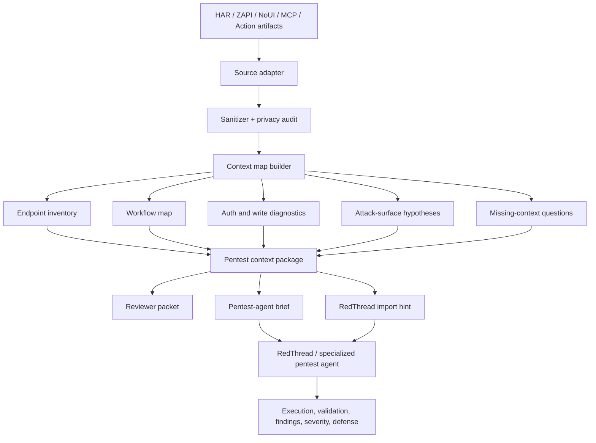

# threadgate

> From HAR to high-signal pentest context.

threadgate is a context compiler for authenticated app security testing.

It turns sensitive runtime evidence — HAR captures, ZAPI exports, NoUI/MCP tool manifests, and action catalogs — into sanitized, structured context packages for RedThread or another specialized pentest agent.

It is not only a gate between a builder plane and RedThread. Its stronger role is to give a downstream pentesting agent superpowers: endpoint inventory, workflow order, auth boundaries, write/destructive hints, tenant/user clues, missing-context questions, and attack-surface hypotheses without dumping raw HAR secrets into a prompt or report.

```text
network HAR / runtime evidence
  -> sanitizer and source-grounded context builder
  -> endpoint, workflow, auth, and attack-surface map
  -> optional opt-in auth/write bundle
  -> structured pentest context package
  -> RedThread or specialized pentest-agent handoff
```

## What threadgate does

threadgate prepares the battlefield.

A raw HAR or runtime capture can contain the app map a pentester needs:

- endpoints,
- methods,
- workflow sequence,
- object IDs,
- auth requirements,
- tenant/user boundaries,
- read/write/destructive behavior,
- response-binding clues,
- missing context needed for safe replay.

But raw HARs are sensitive. They may include cookies, auth headers, session values, request bodies, response bodies, PII, and production identifiers.

threadgate's job is to compile that runtime evidence into a safe, useful package:

- sanitized endpoint inventory,
- workflow map,
- auth/write diagnostics,
- attack-surface hypotheses,
- missing-context questions,
- safety policy,
- reviewer packet,
- pentest-agent brief,
- RedThread import hints.

The package gives the downstream agent high-signal context. The downstream agent still owns execution and validation.

## What threadgate is not

threadgate is not:

- an autonomous pentester,
- a scanner replacement,
- an exploit engine,
- a severity engine,
- a confirmed-finding validator,
- a production release authority,
- a place to store raw secrets or raw HAR values.

It produces source-grounded context and handoff artifacts. It does not claim confirmed vulnerabilities by itself.

## Responsibility split

| Layer | Owns | Does not own |
|---|---|---|
| threadgate | runtime artifact ingestion, sanitization, endpoint/workflow/auth context, attack-surface hypotheses, missing-context questions, safety policy, handoff package | exploitation, confirmed findings, severity, defense, regression, final promotion |
| RedThread / pentest agent | scoped execution, probe selection, exploit validation, JudgeAgent confirmation, findings, severity, defense/remediation, regression, final gate semantics | raw product-specific parsing or default secret handling |
| Builder plane | discovery, generated tools/actions, workflow authoring, draft/test/publish UX | security verdict truth |

Best rule:

> threadgate packages the truth from runtime evidence. RedThread or the pentest agent proves what is exploitable.

## Current status

This is a working prototype bridge with a new pivot toward pentest-context packaging.

What works today:

- ingest ZAPI-style discovery exports,
- ingest HAR-shaped ZAPI captures and extract app-relevant endpoints,
- ingest one NoUI MCP server shape: `manifest.json` + `tools.json`,
- ingest Adopt-style action catalogs,
- normalize discovery lanes into RedThread-friendly fixtures,
- generate replay-pack groups,
- export RedThread replay-bundle inputs,
- evaluate replay traces with RedThread promotion-gate code,
- run generated bridge cases through a real RedThread dry-run campaign path,
- generate machine-readable live attack and workflow plans,
- run policy-gated live safe-read GET replay for allowed cases,
- run reviewed auth-bound safe reads only with explicit approved auth context,
- run reviewed non-destructive staging writes only with explicit approved write context,
- carry bounded workflow state and response-binding evidence across sequential steps,
- emit structured workflow failure reasons,
- run a deterministic ATP-like reviewed-write reference demo,
- run a one-command bridge workflow from one artifact input,
- run a live ZAPI capture into the bridge workflow,
- run an offline-only HAR evidence batch with sanitized aggregate blocker/gap summaries,
- produce reviewer-facing evidence packets, readiness ledgers, remediation queues, and external review handoff artifacts.

New direction being implemented:

- canonical pentest context package v0,
- attack-surface hypotheses marked as hypotheses, not findings,
- RedThread / pentest-agent handoff files,
- optional auth/write bundle contracts kept separate from default safe outputs,
- stronger privacy audit and no-overclaim semantics.

What is not live yet:

- full canonical `pentest_context_package_v0` as the primary output for every lane,
- broad support for all NoUI/MCP output families,
- direct pull from real Adopt services,
- autonomous pentest execution inside this repo,
- confirmed findings or severity from this repo,
- production-grade publish gating,
- RedThread owning final live workflow execution for Adopt-managed sessions.

Honest status:

- **yes:** threadgate can already ingest, normalize, replay, and hand off evidence,
- **yes:** the pivot makes context packaging the primary product shape,
- **no:** threadgate does not prove vulnerabilities or execute a full pentest by itself.

## Architecture


```mermaid
flowchart TD
    A[HAR / ZAPI / NoUI / MCP / Action artifacts] --> B[Source adapter]
    B --> C[Sanitizer + privacy audit]
    C --> D[Context map builder]
    D --> E[Endpoint inventory]
    D --> F[Workflow map]
    D --> G[Auth and write diagnostics]
    D --> H[Attack-surface hypotheses]
    D --> I[Missing-context questions]
    E --> J[Pentest context package]
    F --> J
    G --> J
    H --> J
    I --> J
    J --> K[Reviewer packet]
    J --> L[Pentest-agent brief]
    J --> M[RedThread import hint]
    L --> N[RedThread / specialized pentest agent]
    M --> N
    N --> O[Execution, validation, findings, severity, defense]
```

## Canonical package shape

Target v0 package:

```text
pentest_context_package/
  manifest.json
  package_summary.json
  privacy_audit.json
  safety_policy.json
  endpoint_inventory.json
  workflow_map.json
  attack_surface_hypotheses.json
  auth_requirements.json
  missing_context.json
  pentest_agent_brief.md
  reviewer_packet.md
  redthread_import_hint.json

  auth_bundles/                  # optional, ignored/redacted by default
    approved_auth_bundle.example.json
    approved_write_bundle.example.json
```

JSON is the contract for downstream agents and tests. Markdown is a generated human review view.

Every attack-surface hypothesis should be treated as:

```text
not_a_finding: true
requires_judge_confirmation: true
```

## Evidence model

threadgate can still emit local `approve`, `review`, and `block` style decisions for bridge demos and reviewer workflows.

| Decision | Meaning today | What it proves | What it does not prove |
|---|---|---|---|
| `approve` | Tested path matched the current safe evidence envelope. | The specific replayed workflow passed current checks. | The whole app is safe. |
| `review` | Evidence exists, but risk requires human review. | The system preserved risk semantics instead of forcing a happy path. | Silent publish or mutation is allowed. |
| `block` | Required evidence/context is missing or replay failed. | The system can fail closed and explain why. | The app is bad. |

In the pivot, these are local evidence states. Final confirmed findings, severity, regression, and promotion belong downstream.

## Supported input lanes

### HAR / ZAPI

threadgate can ingest:

- catalog-style ZAPI JSON with endpoint metadata,
- HAR-shaped browser captures,
- local `.har` folders through the offline batch harness.

The HAR lane is conservative. It filters noisy browser traffic, drops obvious static/third-party noise, dedupes app-like API calls, and emits normalized fixture/context artifacts.

Raw HAR files can contain cookies, tokens, IDs, request bodies, response bodies, and private messages. Keep raw HARs out of git and out of prompts.

### NoUI / MCP

threadgate supports one real NoUI output shape today:

```text
manifest.json
+ tools.json
```

This adds useful runtime/tool context:

- auth strategy,
- MCP transport style,
- direct execution vs plain HTTP shape,
- parameter schema,
- response surface,
- tool-callable operation semantics.

### Action catalogs

Action catalogs are mapped into RedThread-friendly and pentest-agent-friendly targets while preserving:

- read/write classification,
- approval requirement,
- destructive potential,
- tenant scope,
- action semantics.

## Opt-in auth and write bundles

Default context packages must not contain raw auth secrets.

Auth and write context can be useful for realistic testing, but only as explicit opt-in bundles:

| Bundle | Purpose | Default state |
|---|---|---|
| `none` | sanitized context only | default |
| `approved_auth_bundle` | authenticated read/context tests | opt-in |
| `approved_write_bundle` | non-production reviewed writes | separate opt-in |
| `blocked_destructive_bundle` | destructive action denied | default for destructive ops |

Rules:

- default package contains no raw auth secrets,
- auth bundles are separate from the default package,
- write bundles are separate from read/auth bundles,
- allowed hosts and environments must be pinned,
- expiry and scope metadata are required,
- bundle values must not appear in Markdown, committed JSON reports, logs, LLM prompts, or git,
- destructive operations remain blocked unless a future explicit destructive-test policy exists.

## Quickstart

### Run tests

```bash
make test
```

### Run the full local demo

```bash
make demo-all
```

This runs the basic fixture flow:

1. ingest sample ZAPI discovery,
2. ingest sample action data,
3. generate replay plans,
4. generate pre-publish gate verdicts.

### Run the one-input bridge pipeline

```bash
python3 scripts/run_bridge_pipeline.py \
  --input fixtures/zapi_samples/sample_filtered_har.json \
  --kind zapi_har \
  --output runs/sample_har_pipeline
```

### Run offline HAR evidence batch

```bash
make evidence-har-batch \
  HAR_INPUT_DIR=./captures \
  HAR_BATCH_OUTPUT=runs/har_batches/batch_001 \
  HAR_BATCH_LIMIT=10
```

Or use a manifest:

```bash
make evidence-har-batch \
  HAR_BATCH_MANIFEST=./manifests/batch.json \
  HAR_BATCH_OUTPUT=runs/har_batches/batch_001
```

This is offline-only. It writes sanitized aggregate follow-up, evidence-review, remediation, and recommended-next-step counts. It does not run live replay, auth reuse, writes, boundary probes, or approval collection.

## Useful commands

```bash
make demo-zapi
make demo-zapi-har
make demo-redthread-runtime
make demo-redthread-dryrun
make demo-noui
make demo-noui-redthread
make demo-adopt-actions
make demo-gate
make demo-bridge-pipeline
make demo-hero-binding-truth
make demo-reviewed-write-reference
make evidence-report
make evidence-matrix
make evidence-packet
make evidence-external-review-handoff
make evidence-external-review-sessions
make evidence-external-validation-readout
make evidence-freshness
make evidence-readiness
make evidence-external-review-distribution
make evidence-external-review-returns
make evidence-remediation-queue
make evidence-boundary-probe-plan
make evidence-boundary-execution-design
make evidence-boundary-probe-context
make evidence-boundary-probe-result
make redthread-contract-proposal
make check-zapi-reference
```

## Key files

Inputs:

- `fixtures/zapi_samples/sample_discovery.json`
- `fixtures/zapi_samples/sample_filtered_har.json`
- `fixtures/noui_samples/expedia_stay_search/manifest.json`
- `fixtures/noui_samples/expedia_stay_search/tools.json`
- `fixtures/adopt_action_samples/sample_actions.json`

Generated sample outputs:

- `fixtures/replay_packs/sample_fixture_bundle.json`
- `fixtures/replay_packs/sample_har_fixture_bundle.json`
- `fixtures/replay_packs/sample_noui_fixture_bundle.json`
- `fixtures/replay_packs/sample_action_fixture_bundle.json`
- `fixtures/replay_packs/sample_replay_plan.json`
- `fixtures/replay_packs/sample_gate_verdict.json`
- `fixtures/replay_packs/sample_har_redthread_runtime_inputs.json`
- `fixtures/replay_packs/sample_har_redthread_replay_verdict.json`
- `fixtures/replay_packs/sample_har_redthread_dryrun_case0.json`

Generated run artifacts:

- `runs/sample_har_pipeline/` — one-command sample pipeline outputs.
- `runs/hero_binding_truth/` — deterministic binding-truth demo artifacts.
- `runs/reviewed_write_reference/` — deterministic reviewed-write reference evidence.
- `runs/evidence_matrix/` — approve/review/block evidence matrix.
- `runs/reviewer_packet/` — sanitized reviewer handoff packet.
- `runs/external_review_handoff/` — external human cold-review handoff.
- `runs/evidence_readiness/` — one-page readiness ledger.
- `runs/evidence_remediation/` — ordered remediation queue.
- `runs/boundary_probe_*` — boundary probe plans, context requests, and result contracts.
- `runs/redthread_evidence_contract_proposal/` — local copy of the generic RedThread evidence-contract proposal.

Most `runs/` artifacts are local and should not be committed unless they are curated, sanitized fixtures.

## Repo structure

```text
adapters/
  adopt_actions/       action/tool mapping
  bridge/              shared bridge helpers
  live_replay/         bounded safe/reviewed replay helpers
  noui/                NoUI/MCP adaptation
  redthread_runtime/   RedThread replay and dry-run export
  zapi/                ZAPI and HAR ingestion

docs/                  direction, architecture, safety, evidence workflows
examples/              end-to-end demo walkthroughs
fixtures/              sample inputs and generated safe fixture outputs
scripts/               CLI-like workflow scripts and evidence builders
tests/                 zero-dependency local tests
```

## Safety boundaries

Never commit:

- raw HARs,
- cookies,
- auth headers,
- session tokens,
- request bodies from real users,
- response bodies with private data,
- production write contexts,
- local `runs/`, `logs/`, or approval-context files unless explicitly sanitized.

Do not run from this repo by default:

- production writes,
- destructive operations,
- broad authenticated replay with copied session cookies,
- autonomous exploitation against real sessions,
- hidden retries that mutate state,
- replay against unknown third-party targets.

Safe only with explicit approved non-production context:

- auth-bound safe reads,
- approved-context replay execution,
- reviewed non-destructive staging writes,
- tenant/user boundary probes,
- any workflow needing IDs, headers, cookies, request bodies, or app-specific values from a real session.

## RedThread interpreter note

Replay evaluation and dry-run execution use the sibling RedThread virtualenv by default:

```text
../redthread/.venv/bin/python
```

That keeps threadgate lightweight while still exercising real RedThread runtime seams.

## Current direction

Primary direction:

> Build the runtime-evidence-to-pentest-context bridge.

Next useful work:

- make `pentest_context_package_v0` the primary output,
- ensure every hypothesis cites sanitized evidence IDs,
- keep every hypothesis marked as not a finding,
- add stronger privacy audits,
- add opt-in auth/write bundle validation,
- generate a better pentest-agent handoff,
- prove RedThread or another agent can import the package and produce better scoped tests.

Defer:

- broad autonomous exploitation,
- production enforcement,
- generic scanner aggregation,
- direct service pulls,
- confirmed finding/severity claims inside threadgate,
- moving product-specific parsing into RedThread.

## Docs map

Start here:

- `docs/pentest-context-bridge-pivot.md` — approved pivot decision and product contract.
- `docs/pentest-context-bridge-implementation-plan.md` — phased implementation plan for package v0 and handoff.
- `docs/project-direction.md` — current direction, scope, proof standard, and proven/not-proven boundary.
- `docs/architecture.md` — integration architecture and ownership split.
- `docs/strategy.md` — why RedThread stays standalone and threadgate stays the bridge.
- `docs/reviewed-write-reference-demo.md` — deterministic reviewed-write reference demo.
- `docs/zapi-reference-demo.md` — real ATP Tennis ZAPI reference demo and `review` evidence standard.
- `docs/reviewer-validation-loop.md` — cold-review protocol and multi-review validation rollup.
- `docs/approved-context-replay-v1.md` — narrow approval-gated endpoint replay/proof slice.
- `docs/redthread-evidence-contract-proposal.md` — tiny generic evidence-contract proposal.

## What good looks like

A downstream pentest agent or RedThread run should be able to consume the context package and answer:

- what endpoints exist,
- how workflows are sequenced,
- which operations need auth or write approval,
- which boundaries look tenant/user-sensitive,
- what attack-surface hypotheses are worth testing,
- what evidence supports each hypothesis,
- what context is missing before safe execution,
- what is not proven yet.

A human reviewer should be able to inspect the generated packet without seeing raw secrets.

That is the bar for threadgate.
