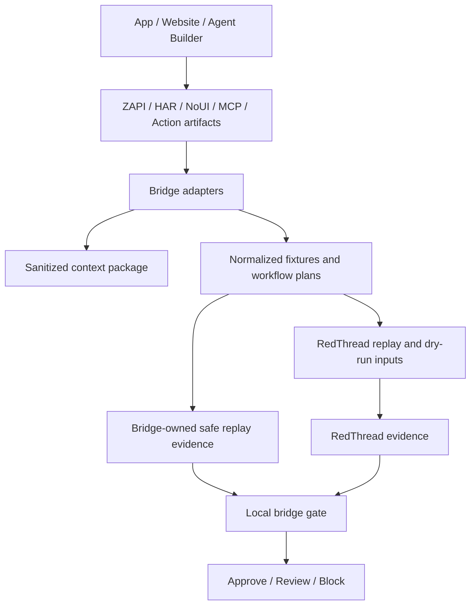

# adopt-redthread

> Turn discovered agent/tool surfaces into sanitized security evidence RedThread can attack, replay, and judge.

adopt-redthread is the bridge between an agent-builder plane and the RedThread security assurance engine.

It does one focused job:

```text
discovery artifact
  -> sanitized app/tool/workflow context
  -> normalized replay fixtures
  -> bridge-owned safe replay evidence
  -> RedThread replay / dry-run evidence
  -> reviewer-facing approve / review / block decision
```

This repo is not trying to be a broad scanner. It is not a fake autonomous pentest platform. It is a local/reference implementation for turning ZAPI, HAR, NoUI, MCP, and Adopt-style action artifacts into evidence a reviewer can inspect before trusting or publishing an agent workflow.

## The core idea

RedThread is the standalone security engine:

- generate attacks,
- execute/replay target behavior,
- score with a judge,
- synthesize defense candidates,
- validate with replay,
- preserve promotion evidence.

This repo gives RedThread better application context without polluting RedThread with product-specific parsing.

In plain English:

> The builder plane discovers and builds tool surfaces. adopt-redthread sanitizes and packages those surfaces. RedThread evaluates normalized security inputs. adopt-redthread combines local workflow evidence and RedThread evidence into `approve`, `review`, or `block`.

## Current status

This is a working prototype bridge.

What works today:

- ingest ZAPI-style discovery exports,
- ingest HAR-shaped ZAPI captures and extract app-relevant endpoints,
- ingest one NoUI MCP server shape: `manifest.json` + `tools.json`,
- ingest Adopt-style action catalogs,
- normalize discovery lanes into RedThread-friendly fixtures,
- generate replay-pack groups,
- export RedThread replay-bundle inputs,
- evaluate replay traces with RedThread promotion-gate code,
- run generated bridge cases through a real RedThread dry-run campaign path,
- generate machine-readable live attack and workflow plans,
- run policy-gated live safe-read GET replay for allowed cases,
- run reviewed auth-bound safe reads only with explicit approved auth context,
- run reviewed non-destructive staging writes only with explicit approved write context,
- carry bounded workflow state and response-binding evidence across sequential steps,
- emit structured workflow failure reasons,
- run a deterministic ATP-like reviewed-write reference demo,
- run a one-command bridge workflow from one artifact input,
- run a live ZAPI capture into the bridge workflow,
- run an offline-only HAR evidence batch with sanitized aggregate blocker/gap summaries,
- produce reviewer-facing evidence packets, readiness ledgers, remediation queues, and external review handoff artifacts.

What is not live yet:

- direct pull from real Adopt services,
- broad support for all NoUI/MCP output families,
- full session-aware authenticated replay beyond approved header reuse,
- broad reviewed write coverage beyond the first deterministic reference lane,
- fully automatic live RedThread attack execution against real Adopt-managed sessions,
- production-grade publish gating,
- RedThread owning final live workflow execution for Adopt-managed sessions.

Honest status:

- **yes:** the bridge prototype runs end to end,
- **no:** this is not a full production integration or universal safety proof.

## Why this repo exists

`redthread/` should stay generic and upstream-safe.

RedThread owns reusable security logic:

- attack algorithms,
- JudgeAgent scoring,
- replay and promotion gates,
- defense synthesis,
- agentic-security controls,
- telemetry and evidence semantics.

This repo owns integration glue:

- ZAPI ingestion,
- HAR filtering,
- NoUI/MCP tool-shape mapping,
- Adopt action mapping,
- sanitized context packaging,
- replay-pack generation,
- local workflow replay demos,
- reviewer-facing bridge reports,
- prototype pre-publish gate decisions.

Rule of thumb:

> Generic assurance belongs in RedThread. Product/discovery-specific adaptation belongs here.

## Architecture


```mermaid
flowchart TD
    A[App / Website / Agent Builder] --> B[ZAPI / HAR / NoUI / MCP / Action artifacts]
    B --> C[Bridge adapters]
    C --> D[Sanitized context package]
    C --> E[Normalized fixtures and workflow plans]
    E --> F[Bridge-owned safe replay evidence]
    E --> G[RedThread replay and dry-run inputs]
    G --> H[RedThread evidence]
    F --> I[Local bridge gate]
    H --> I
    I --> J[Approve / Review / Block]
```

### Ownership split

| Layer | Owns | Does not own yet |
|---|---|---|
| Builder plane | discovery, tool generation, action/workflow authoring | security verdict truth |
| adopt-redthread | normalization, sanitization, context packaging, local evidence, handoff | generic attack engine or production enforcement |
| RedThread | attack, judge, replay, defense, promotion evidence | product-specific parsing or final bridge business decision |

## Evidence model

The project treats `approve`, `review`, and `block` as different useful outcomes.

| Decision | Meaning today | What it proves | What it does not prove |
|---|---|---|---|
| `approve` | Tested path matched the safe evidence envelope. | The specific replayed workflow passed its current checks. | The whole app is safe. |
| `review` | Evidence exists, but risk requires human review. | The bridge preserved risk semantics instead of forcing a happy path. | Silent publish is allowed. |
| `block` | Required evidence/context is missing or replay failed. | The system can fail closed and explain why. | The app is bad. |

A `review` or `block` result is not a demo failure. For write-capable, auth-bound, tenant-sensitive workflows, conservative outcomes are the point.

## Main use case

Use this repo before trusting or publishing an agent/tool workflow.

It helps answer:

- What endpoints, tools, and workflows were discovered?
- Which operations are read-only, mutating, destructive, auth-bound, or tenant-sensitive?
- What replay evidence exists?
- What did RedThread evaluate?
- Why did the gate approve, review, or block?
- What context is missing before safe execution?
- What is not proven yet?

Best current wedge:

> Evidence-backed workflow assurance for generated or discovered agent tools before publish.

## Supported input lanes

### ZAPI / HAR

The bridge can ingest:

- catalog-style ZAPI JSON with endpoint metadata,
- HAR-shaped browser captures,
- local `.har` folders through the offline batch harness.

The HAR lane is conservative. It filters noisy browser traffic, drops obvious static/third-party noise, dedupes app-like API calls, and emits normalized fixture bundles.

Raw HAR files can contain cookies, tokens, IDs, request bodies, response bodies, and private messages. Keep raw HARs out of git.

### NoUI / MCP

The bridge supports one real NoUI output shape today:

```text
manifest.json
+ tools.json
```

This adds useful runtime/tool context:

- auth strategy,
- MCP transport style,
- direct execution vs plain HTTP shape,
- parameter schema,
- response surface,
- tool-callable operation semantics.

### Adopt actions

Adopt-style action catalogs are mapped into RedThread-friendly targets while preserving:

- read/write classification,
- approval requirement,
- destructive potential,
- tenant scope,
- action semantics.

## Quickstart

### Run tests

```bash
make test
```

### Run the full local demo

```bash
make demo-all
```

This runs the basic fixture flow:

1. ingest sample ZAPI discovery,
2. ingest sample Adopt actions,
3. generate replay plans,
4. generate pre-publish gate verdicts.

### Run the one-input bridge pipeline

```bash
python3 scripts/run_bridge_pipeline.py \
  --input fixtures/zapi_samples/sample_filtered_har.json \
  --kind zapi_har \
  --output runs/sample_har_pipeline
```

### Run the reviewed-write reference demo

```bash
make demo-reviewed-write-reference
```

Expected result: `review`, not `approve`.

That is correct because reviewed write paths require human approval and non-production context.

### Run evidence matrix

```bash
make evidence-matrix
```

The matrix should preserve three different states:

- `approve` for deterministic safe-read binding evidence,
- `review` for deterministic reviewed-write evidence,
- `block` when required context is missing.

### Run offline HAR evidence batch

```bash
make evidence-har-batch \
  HAR_INPUT_DIR=./captures \
  HAR_BATCH_OUTPUT=runs/har_batches/batch_001 \
  HAR_BATCH_LIMIT=10
```

Or use a manifest:

```bash
make evidence-har-batch \
  HAR_BATCH_MANIFEST=./manifests/batch.json \
  HAR_BATCH_OUTPUT=runs/har_batches/batch_001
```

This is offline-only. It writes sanitized aggregate follow-up, evidence-review, remediation, and recommended-next-step counts. It does not run live replay, auth reuse, writes, boundary probes, or approval collection.

## Useful commands

```bash
make demo-zapi
make demo-zapi-har
make demo-redthread-runtime
make demo-redthread-dryrun
make demo-noui
make demo-noui-redthread
make demo-adopt-actions
make demo-gate
make demo-bridge-pipeline
make demo-hero-binding-truth
make demo-reviewed-write-reference
make evidence-report
make evidence-matrix
make evidence-packet
make evidence-external-review-handoff
make evidence-external-review-sessions
make evidence-external-validation-readout
make evidence-freshness
make evidence-readiness
make evidence-external-review-distribution
make evidence-external-review-returns
make evidence-remediation-queue
make evidence-boundary-probe-plan
make evidence-boundary-execution-design
make evidence-boundary-probe-context
make evidence-boundary-probe-result
make redthread-contract-proposal
make check-zapi-reference
```

## Key files

Inputs:

- `fixtures/zapi_samples/sample_discovery.json`
- `fixtures/zapi_samples/sample_filtered_har.json`
- `fixtures/noui_samples/expedia_stay_search/manifest.json`
- `fixtures/noui_samples/expedia_stay_search/tools.json`
- `fixtures/adopt_action_samples/sample_actions.json`

Generated sample outputs:

- `fixtures/replay_packs/sample_fixture_bundle.json`
- `fixtures/replay_packs/sample_har_fixture_bundle.json`
- `fixtures/replay_packs/sample_noui_fixture_bundle.json`
- `fixtures/replay_packs/sample_action_fixture_bundle.json`
- `fixtures/replay_packs/sample_replay_plan.json`
- `fixtures/replay_packs/sample_gate_verdict.json`
- `fixtures/replay_packs/sample_har_redthread_runtime_inputs.json`
- `fixtures/replay_packs/sample_har_redthread_replay_verdict.json`
- `fixtures/replay_packs/sample_har_redthread_dryrun_case0.json`

Generated run artifacts:

- `runs/sample_har_pipeline/` — one-command sample pipeline outputs.
- `runs/hero_binding_truth/` — deterministic binding-truth demo artifacts.
- `runs/reviewed_write_reference/` — deterministic reviewed-write reference evidence.
- `runs/evidence_matrix/` — approve/review/block evidence matrix.
- `runs/reviewer_packet/` — sanitized reviewer handoff packet.
- `runs/external_review_handoff/` — external human cold-review handoff.
- `runs/evidence_readiness/` — one-page readiness ledger.
- `runs/evidence_remediation/` — ordered remediation queue.
- `runs/boundary_probe_*` — boundary probe plans, context requests, and result contracts.
- `runs/redthread_evidence_contract_proposal/` — local copy of the generic RedThread evidence-contract proposal.

Most `runs/` artifacts are local and should not be committed unless they are curated, sanitized fixtures.

## Repo structure

```text
adapters/
  adopt_actions/       Adopt action/tool mapping
  bridge/              shared bridge helpers
  live_replay/         bounded safe/reviewed replay helpers
  noui/                NoUI/MCP adaptation
  redthread_runtime/   RedThread replay and dry-run export
  zapi/                ZAPI and HAR ingestion

docs/                  direction, architecture, safety, evidence workflows
examples/              end-to-end demo walkthroughs
fixtures/              sample inputs and generated safe fixture outputs
scripts/               CLI-like workflow scripts and evidence builders
tests/                 zero-dependency local tests
```

## Safety boundaries

Do not run or commit unsafe artifacts.

Never commit:

- raw HARs,
- cookies,
- auth headers,
- session tokens,
- request bodies from real users,
- response bodies with private data,
- production write contexts,
- local `runs/`, `logs/`, or approval-context files unless explicitly sanitized.

Do not run:

- production writes,
- destructive operations,
- broad authenticated replay with copied session cookies,
- automatic RedThread live attacks against real sessions,
- hidden retries that mutate state,
- replay against unknown third-party targets.

Safe only with explicit approved non-production context:

- auth-bound safe reads,
- approved-context replay execution,
- reviewed non-destructive staging writes,
- tenant/user boundary probes,
- any workflow needing IDs, headers, cookies, request bodies, or app-specific values from a real session.

## RedThread interpreter note

Replay evaluation and dry-run execution use the sibling RedThread virtualenv by default:

```text
../redthread/.venv/bin/python
```

That keeps this bridge lightweight while still exercising real RedThread runtime seams.

## Current direction

Primary direction:

> Make the reviewer-facing evidence path unmistakably clear.

The next useful improvements are not broad platform expansion. They are better proof artifacts:

- clearer evidence reports,
- stable approve/review/block examples,
- sanitized reviewer packets,
- stronger reason taxonomy,
- better RedThread context fields,
- approved-context replay proof for one endpoint at a time,
- reviewer validation that confirms the artifact is understandable without a walkthrough.

Defer:

- generic scanner aggregation,
- production enforcement,
- broad autonomous live attacks,
- direct Adopt service pulls,
- large NoUI coverage expansion,
- moving product-specific parsing into RedThread.

## Docs map

Start here:

- `docs/project-direction.md` — current direction, scope, proof standard, and proven/not-proven boundary.
- `docs/architecture.md` — integration architecture and ownership split.
- `docs/strategy.md` — why RedThread stays standalone and adopt-redthread stays the bridge.
- `docs/reviewed-write-reference-demo.md` — deterministic reviewed-write reference demo.
- `docs/zapi-reference-demo.md` — real ATP Tennis ZAPI reference demo and `review` evidence standard.
- `docs/reviewer-validation-loop.md` — cold-review protocol and multi-review validation rollup.
- `docs/approved-context-replay-v1.md` — narrow approval-gated endpoint replay/proof slice.
- `docs/redthread-evidence-contract-proposal.md` — tiny generic evidence-contract proposal.

## What good looks like

A reviewer should be able to open one evidence report or matrix and answer:

- what input was tested,
- what workflow ran,
- what RedThread evaluated,
- what was approved, reviewed, or blocked,
- why that decision happened,
- what context is missing,
- what is not proven.

That is the bar for this repo.
