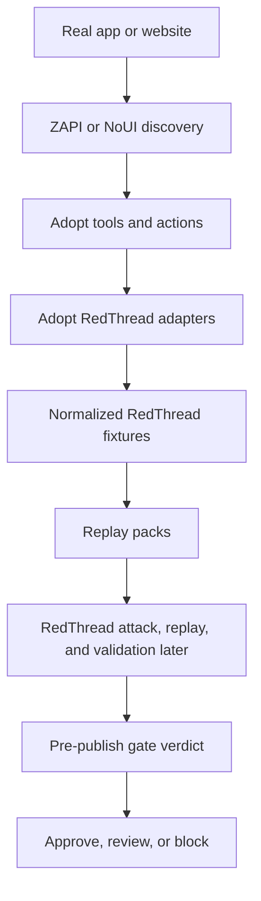

# Architecture

## Goal

Use Adopt AI as the **agent builder plane** and RedThread as the **security assurance plane**.

This repo wires the two together.

---

## High-level flow

## Current maturity

Today this architecture is real at the **artifact bridge** layer.

Implemented now:
- sample ZAPI-style discovery intake
- sample Adopt action catalog intake
- fixture normalization
- replay-pack generation
- prototype pre-publish gate

Not implemented yet:
- live calls into real Adopt services
- live parsing of confirmed real-world ZAPI export schemas
- real RedThread execution against live Adopt-built agents
- CI or release-system wiring for automatic publish gates

---

## System ownership

## Adopt AI owns

- discovery of APIs and workflows
- tool and action generation
- builder UX and operator workflow
- draft/test/publish lifecycle
- authenticated browser-native capture when needed

## RedThread owns

- attack generation
- replay execution
- evaluation and verdicts
- security hardening evidence
- authorization and workflow abuse testing
- promotion-gate recommendations

## Adopt RedThread owns

- schema mapping between Adopt output and RedThread input
- endpoint risk classification
- replay-pack generation
- integration scripts and demos
- pre-publish security gate experiments

---

## Core components in this repo

## 1. ZAPI adapter

Path:
- `adapters/zapi/`

Job:
- ingest documented API output from ZAPI
- normalize endpoint metadata
- preserve useful fields such as:
  - method
  - path
  - summary
  - params
  - auth hints
  - workflow grouping

Output:
- normalized discovery artifact
- first-pass risk labels

## 2. Adopt action adapter

Path:
- `adapters/adopt_actions/`

Job:
- map Adopt actions or tool definitions into RedThread-friendly target shapes
- preserve action semantics like:
  - read vs write
  - approval requirement
  - destructive potential
  - tenant scope

Output:
- action fixture catalog
- action replay targets

## 3. Fixture store

Path:
- `fixtures/`

Job:
- keep sample inputs and generated outputs visible

Subfolders:
- `fixtures/zapi_samples/` — sample discovery exports
- `fixtures/replay_packs/` — generated replay bundles

## 4. Replay planner

Path:
- `scripts/`

Job:
- take normalized discovery or action catalogs
- classify risk
- decide what can be safely replayed first

Example outputs:
- safe read-only replay set
- high-risk endpoints requiring sandbox only
- action-level abuse scenarios
- multi-turn workflow scenarios

## 5. Example demos

Path:
- `examples/`

Job:
- show small end-to-end flows for recruiter demos and internal testing

---

## Phased workflow

## Phase 1 — Discovery intake

Inputs:
- ZAPI output
- manually curated API docs
- later: NoUI-generated surfaces

Work done here:
- parse discovery artifacts
- normalize endpoint shapes
- tag auth and risk hints

Output:
- normalized endpoint catalog

## Phase 2 — Risk classification

Work done here:
- classify endpoints into buckets such as:
  - read-only
  - mutating
  - destructive
  - sensitive
  - approval-needed
  - tenant-sensitive

Output:
- risk-annotated catalog

## Phase 3 — Fixture generation

Work done here:
- convert catalog into RedThread-friendly fixtures
- prepare replayable units
- generate scenario seeds

Output:
- fixture bundle
- replay planning metadata

## Phase 4 — Action-level testing

Work done here:
- map Adopt actions into targetable units
- run natural-language attack suites against them
- inspect wrong tool choice and unsafe action activation

Output:
- action-level findings
- replay packs for repeated validation

## Phase 5 — Pre-publish gate

Work done here:
- run selected replay packs automatically before publish
- collect benign and adversarial evidence
- produce approve/block recommendation

Output:
- security gate verdict

---

## Complexity ladder

## Level 0 — Discovery only

Use when:
- we only need capability mapping

Main artifact:
- endpoint catalog

## Level 1 — Safe endpoint replay

Use when:
- we can safely test read paths first

Main artifact:
- low-risk replay pack

## Level 2 — Action-level testing

Use when:
- Adopt has already generated tools/actions

Main artifact:
- action attack pack

## Level 3 — Multi-turn workflow testing

Use when:
- business logic emerges across several steps

Main artifact:
- grouped conversation replay suite

## Level 4 — Auth-aware live replay

Use when:
- session context matters and sandbox controls exist

Main artifact:
- intercepted staging replay suite

## Level 5 — Publish gate

Use when:
- release workflow is mature enough for automatic security evidence

Main artifact:
- ship/no-ship recommendation

---

## Design constraints

- keep RedThread core reusable and upstream-first
- keep Adopt-specific code isolated here
- prefer wrappers over forks
- prefer staging over production for risky replay
- tag write/destructive paths before any live execution
- build recruiter demos from small, explainable slices

---

## First implementation target

Best first build:

1. ingest one ZAPI sample
2. normalize endpoints
3. classify risk
4. generate one replay-pack draft

That gives the first concrete seam between the systems.
