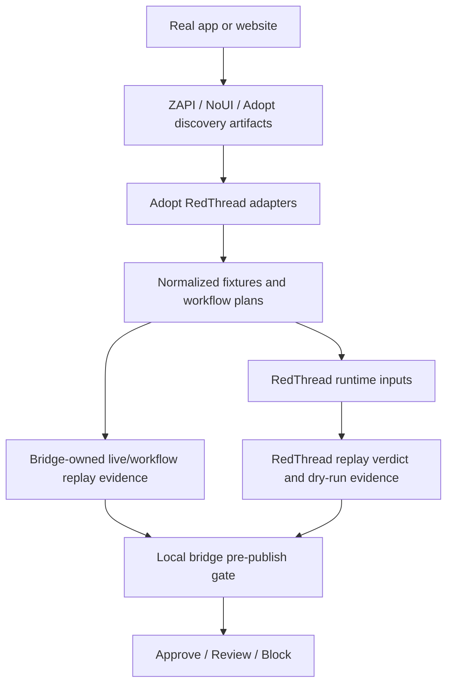

# Architecture

## Goal

Use Adopt AI as the **agent builder plane**, this repo as the **evidence bridge**, and RedThread as the **security assurance engine**.

This repo wires the two together without pretending the full production loop exists yet.

---

## High-level flow

Current truth: RedThread's replay verdict is an input to the local bridge gate. The local gate currently decides `approve`, `review`, or `block`.

## Current maturity

Today this architecture is real at the **artifact bridge** layer.

Implemented now:
- sample ZAPI-style discovery intake
- real HAR-shaped ZAPI intake with app-endpoint extraction
- sample NoUI MCP manifest/tools intake
- sample Adopt action catalog intake
- fixture normalization
- replay-pack generation
- prototype pre-publish gate
- machine-readable live attack planning with execution policy fields
- first live safe-read GET replay lane for policy-allowed cases
- reviewed auth-bound safe-read GET replay with explicit approved auth context
- first reviewed non-destructive staging write lane with explicit per-case approved write context
- first grouped sequential workflow replay lane with stop-on-first-failure behavior
- bounded workflow evidence carry-forward with structured workflow failure reasons
- RedThread replay-bundle export
- RedThread promotion-gate evaluation against exported bundles
- RedThread dry-run campaign execution from generated bridge cases
- one-command bridge workflow from one artifact input
- one-command live ZAPI capture runner that feeds selected HAR into the bridge workflow

Not implemented yet:
- live calls into real Adopt services
- broad support for all confirmed real-world NoUI output families beyond the first MCP server shape
- full session-aware live replay beyond explicit approved header reuse
- richer workflow state beyond the new bounded evidence-carry-forward grouped replay
- broader reviewed write coverage beyond the first non-destructive staging lane
- fully automatic live RedThread attack execution against a real Adopt-built session immediately after discovery
- RedThread independently owning live workflow execution for Adopt-managed sessions
- CI or release-system wiring for automatic publish gates

---

## System ownership

## Adopt AI owns

- discovery of APIs and workflows
- tool and action generation
- builder UX and operator workflow
- draft/test/publish lifecycle
- authenticated browser-native capture when needed

## RedThread owns

- generic attack generation
- generic replay evaluation
- dry-run campaign execution
- security hardening evidence
- authorization and workflow abuse testing
- promotion-gate recommendations inside RedThread

Current boundary: RedThread provides replay/dry-run evidence to this repo. It does not currently make the final bridge `approve/review/block` decision.

## Adopt RedThread owns

- schema mapping between Adopt output and RedThread input
- endpoint risk classification
- replay-pack generation
- bounded live safe-read and workflow replay for bridge demos
- integration scripts and demos
- pre-publish security gate experiments
- the current final `approve/review/block` decision over combined bridge + RedThread evidence

---

## Core components in this repo

## 1. ZAPI adapter

Path:
- `adapters/zapi/`

Job:
- ingest documented API output from ZAPI
- ingest HAR-derived captures from ZAPI demos or local sessions
- normalize endpoint metadata
- preserve useful fields such as:
  - method
  - path
  - summary
  - params
  - auth hints
  - workflow grouping

Output:
- normalized discovery artifact
- first-pass risk labels
- deduped app endpoints extracted from noisy browser captures
- downstream bridge inputs that can be converted into RedThread replay and dry-run execution payloads

## 2. Adopt action adapter

Path:
- `adapters/adopt_actions/`

Job:
- map Adopt actions or tool definitions into RedThread-friendly target shapes
- preserve action semantics like:
  - read vs write
  - approval requirement
  - destructive potential
  - tenant scope

Output:
- action fixture catalog
- action replay targets

## 3. Fixture store

Path:
- `fixtures/`

Job:
- keep sample inputs and generated outputs visible

Subfolders:
- `fixtures/zapi_samples/` — sample discovery exports
- `fixtures/replay_packs/` — generated replay bundles

## 4. Replay planner

Path:
- `scripts/`

Job:
- take normalized discovery or action catalogs
- classify risk
- decide what can be safely replayed first

Example outputs:
- safe read-only replay set
- high-risk endpoints requiring sandbox only
- action-level abuse scenarios
- multi-turn workflow scenarios

## 5. Example demos

Path:
- `examples/`

Job:
- show small end-to-end flows for recruiter demos and internal testing

---

## Phased workflow

## Phase 1 — Discovery intake

Inputs:
- ZAPI catalog-style output
- ZAPI HAR-derived browser captures
- NoUI MCP server outputs (`manifest.json` + `tools.json`)
- manually curated API docs
- later: more NoUI output families and skill/runtime artifacts

## New runtime bridge seam

After normalization, the bridge can now go one step farther:

1. build a replay bundle shaped like RedThread's `ReplayBundle`
2. build dry-run campaign cases shaped like RedThread's `CampaignConfig`
3. evaluate the replay bundle with RedThread's real promotion gate
4. execute one generated case through a real RedThread dry-run campaign

This is still conservative.
The bridge is not claiming live enterprise execution.
It is claiming that normalized Adopt-side artifacts can now reach real RedThread replay and dry-run runtime seams.

## Why NoUI matters here

ZAPI helps discover endpoints.
NoUI helps discover **agent-callable operations** with runtime/auth context.

That extra context gives the bridge better security hints such as:
- authenticated browser-session execution
- MCP transport style
- direct execution vs plain HTTP shape
- tool parameter and response surface

So the combined picture gets better:
- ZAPI gives low-level app/API surface
- NoUI gives operation/runtime/tool surface
- RedThread still does the attack, replay, validation, and hardening work

Work done here:
- parse discovery artifacts
- filter noisy HAR traffic down to app-relevant API calls
- normalize endpoint shapes
- tag auth and risk hints
- export real RedThread replay traces
- export real RedThread dry-run campaign cases

Output:
- normalized endpoint catalog

## Phase 2 — Risk classification

Work done here:
- classify endpoints into buckets such as:
  - read-only
  - mutating
  - destructive
  - sensitive
  - approval-needed
  - tenant-sensitive

Output:
- risk-annotated catalog

## Phase 3 — Fixture generation

Work done here:
- convert catalog into RedThread-friendly fixtures
- prepare replayable units
- generate scenario seeds

Output:
- fixture bundle
- replay planning metadata

## Phase 4 — Action-level testing

Work done here:
- map Adopt actions into targetable units
- run natural-language attack suites against them
- inspect wrong tool choice and unsafe action activation

Output:
- action-level findings
- replay packs for repeated validation

## Phase 5 — Pre-publish gate

Work done here:
- run selected replay packs automatically before publish
- collect benign and adversarial evidence
- produce approve/block recommendation

Output:
- security gate verdict

---

## Complexity ladder

## Level 0 — Discovery only

Use when:
- we only need capability mapping

Main artifact:
- endpoint catalog

## Level 1 — Safe endpoint replay

Use when:
- we can safely test read paths first

Main artifact:
- low-risk replay pack

## Level 2 — Action-level testing

Use when:
- Adopt has already generated tools/actions

Main artifact:
- action attack pack

## Level 3 — Multi-turn workflow testing

Use when:
- business logic emerges across several steps

Main artifact:
- grouped conversation replay suite

## Level 4 — Auth-aware live replay

Use when:
- session context matters and sandbox controls exist

Main artifact:
- intercepted staging replay suite

## Level 5 — Publish gate

Use when:
- release workflow is mature enough for automatic security evidence

Main artifact:
- ship/no-ship recommendation

---

## Design constraints

- keep RedThread core reusable and upstream-first
- keep Adopt-specific code isolated here
- prefer wrappers over forks
- prefer staging over production for risky replay
- tag write/destructive paths before any live execution
- build recruiter demos from small, explainable slices

---

## First implementation target

Best first build:

1. ingest one ZAPI sample
2. normalize endpoints
3. classify risk
4. generate one replay-pack draft

That gives the first concrete seam between the systems.
