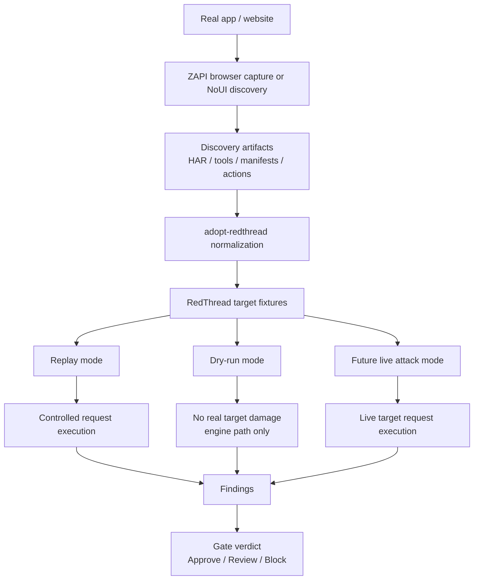
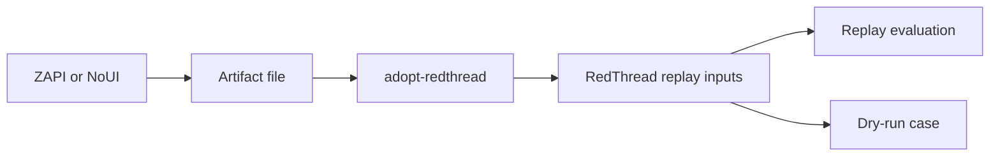
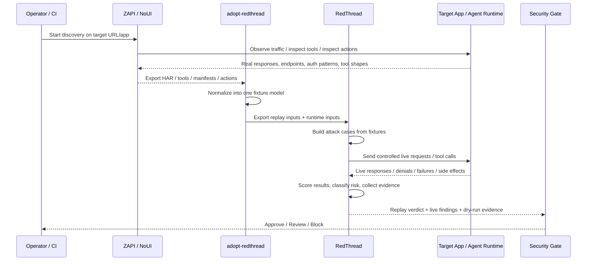
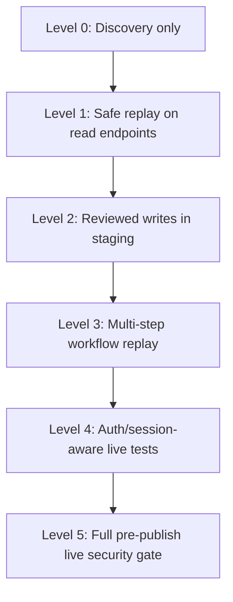
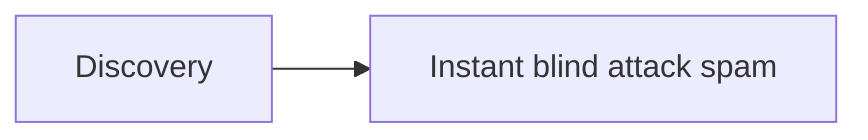
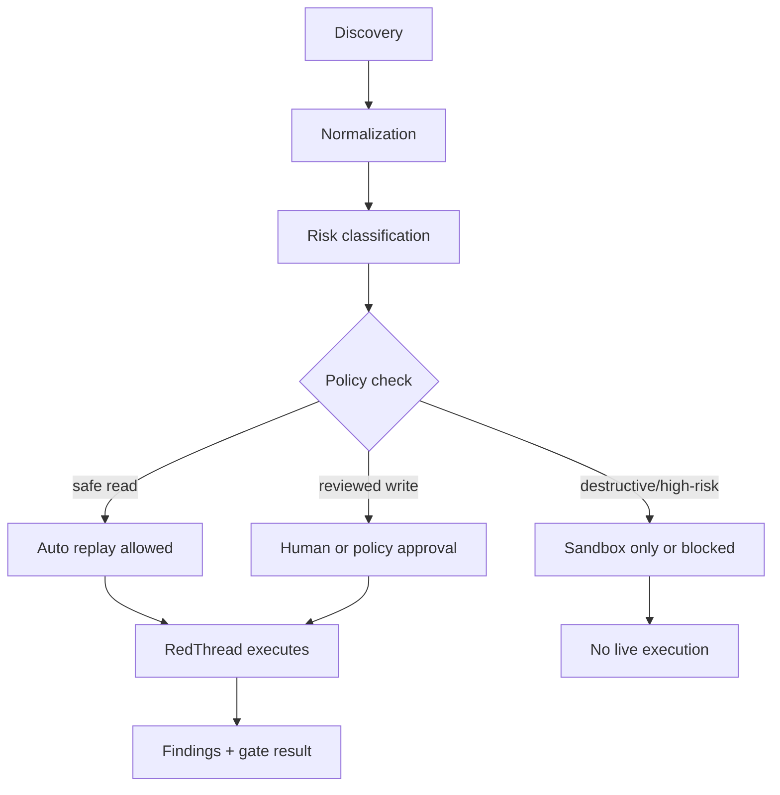
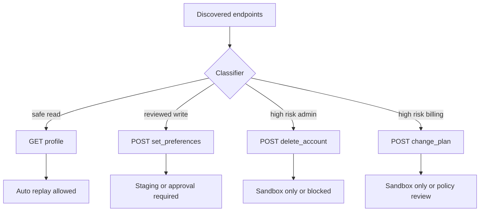
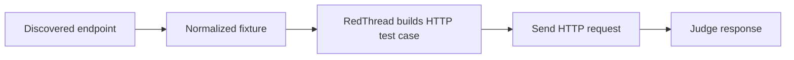
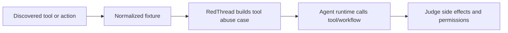
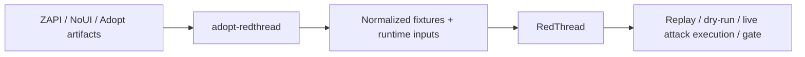

# Full Live Loop Diagram

## Short answer

Yes.
In the future **some requests will be sent automatically**.

Also: the best near-term path is **human-guided ZAPI discovery first, automation second**.

But not all at once, and not blindly.

There are really **3 levels**:

1. **Artifact mode**
   - a human uses ZAPI/NoUI to watch the app
   - saves HAR / tools / manifests
   - `adopt-redthread` normalizes them
   - RedThread replays and dry-runs from exported inputs
   - safest mode

2. **Replay mode**
   - RedThread sends controlled requests based on discovered endpoints/tools
   - usually against test/staging or tightly constrained targets
   - proves policy, auth, and tool safety more realistically

3. **Full live attack loop**
   - discovery happens
   - normalization happens
   - RedThread automatically builds attack cases
   - RedThread actually executes them against a live target runtime
   - findings feed a gate decision

So yes: in the final version, **RedThread will send requests automatically**.
That is the point.
But it should do it through **gated stages**, not like a blind chaos monkey.

---

## The simple picture



---

## What sends requests?

## Today

Today the most real flow is this:



Here:
- a human drives the ZAPI browser session while discovering
- ZAPI sends browser traffic while recording
- the app itself responds
- `adopt-redthread` mostly transforms files
- RedThread mostly evaluates exported cases

So today the bridge is mostly:
- **human-guided capture**
- **translate**
- **evaluate**

Not yet:
- full live attack execution against the real target discovered moments earlier

---

## Future full live loop

This is the thing you are asking about.



---

## What exactly gets automated?

In the future full loop, this becomes automatic:

1. **Discovery start**
   - open target URL
   - browse / observe / collect traffic or tools

2. **Artifact export**
   - save HAR
   - save tool descriptions
   - save auth/workflow hints

3. **Normalization**
   - classify each endpoint/tool/action
   - label read/write/admin/payment/auth-sensitive/etc.

4. **Attack generation**
   - build RedThread cases like:
     - prompt injection
     - auth bypass
     - unsafe write activation
     - overbroad data access
     - action confusion
     - destructive workflow abuse

5. **Live execution**
   - RedThread sends actual requests
   - maybe HTTP
   - maybe tool calls
   - maybe multi-step workflows
   - maybe session-aware requests if auth is needed

6. **Judging and gate**
   - did it bypass auth?
   - did it leak data?
   - did it trigger unsafe action?
   - did controls block it?
   - pass / review / block

So yes: **the future system does real request execution**.

---

## The safer rollout path

Do **not** jump straight into full live attack mode everywhere.

Use steps.



### Level 0 — Discovery only
- no RedThread live requests
- only capture and normalize

### Level 1 — Safe replay
- RedThread only hits safe read endpoints
- good for proving end-to-end loop

### Level 2 — Reviewed writes
- RedThread can send writes
- but only approved ones
- usually staging/sandbox only

### Level 3 — Workflow replay
- multi-request flows
- example: search -> retrieve detail -> update preference

### Level 4 — Auth/session-aware testing
- use session tokens/cookies/headers safely
- test real permission boundaries

### Level 5 — Publish gate
- run before release
- if serious issue found, block release

---

## The control point diagram

This is the important part.

You do **not** want:



You want:



This is how you stop the system from becoming dumb and dangerous.

---

## Concrete example

Say ZAPI discovers these endpoints:

- `GET /api/user/profile`
- `POST /api/user/set_preferences`
- `POST /api/admin/delete_account`
- `POST /api/billing/change_plan`

Then the future loop would treat them differently.



So no, the system should not just smash every endpoint automatically.
It should send requests based on:
- classification
- policy
- environment
- approval mode

---

## Two possible future execution styles

## Style A — HTTP/API-first

This is the simpler path.



Use this when:
- target is mostly API driven
- HAR gives enough information
- auth/session handling is manageable

## Style B — Tool/workflow-first

This is richer.



Use this when:
- target is agentic
- tool calling matters more than raw endpoints
- confused deputy / action abuse is the main risk

Real future system likely uses **both**.

---

## What `adopt-redthread` does vs what RedThread does



### `adopt-redthread`
Job:
- ingest messy outside artifacts
- normalize them
- classify them
- export clean RedThread inputs

### RedThread
Job:
- generate cases
- execute cases
- judge cases
- decide pass/review/block

So:
- **adopt-redthread is the adapter**
- **RedThread is the attack engine**

---

## Best practical future command

The end goal is something like this:

```bash
python3 scripts/run_live_zapi_bridge.py \
  "https://target-app.example" \
  runs/live_target_check \
  --zapi-repo /path/to/zapi \
  --mode live-attack \
  --policy reviewed \
  --target-env staging
```

And under the hood it would do:

1. run discovery
2. export artifacts
3. normalize fixtures
4. classify risk
5. choose allowed execution lane
6. run RedThread replay
7. run RedThread live attack cases
8. emit final gate verdict

---

## Best honest summary

If you ask:

**"Will we send requests automatically?"**

Answer:
**Yes. In the real full loop, absolutely yes.**

If you ask:

**"Will it blindly attack everything discovered by ZAPI?"**

Answer:
**It should not.**

Correct shape is:
- human-guided discover
- normalize
- classify
- policy check
- then execute only the allowed lane

So the future full loop is:

```text
live discovery -> normalized targets -> policy gate -> controlled RedThread execution -> findings -> release gate
```

That is the real picture.

If you want the actual build order for this, see `docs/live-attack-implementation-plan.md`.
