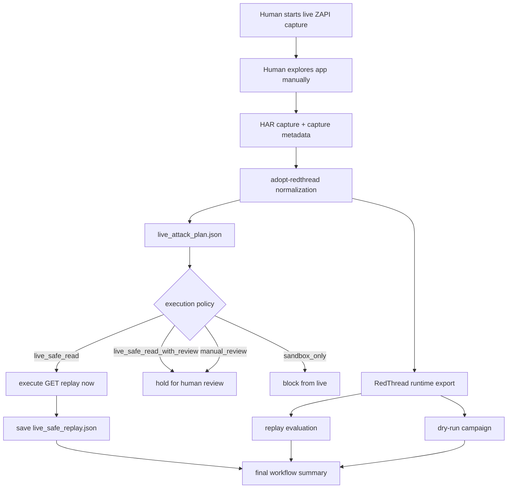

# Live Attack Implementation Plan

## Blunt answer

We should build live attack mode in **controlled steps**.

Not like this:
- auto-discover everything
- auto-send risky requests
- hope it works

Like this:
- human captures reality first
- bridge normalizes it
- policy classifies it
- only low-risk read cases can run automatically
- everything riskier stays review-gated

That is now the implemented shape.

---

## What is implemented now

## Phase status

| Phase | Status | What it does |
|---|---|---|
| Phase 1 — Interactive capture | done | human-guided ZAPI capture is now an explicit first-class mode |
| Phase 2 — Machine-readable live plan | done | bridge emits `live_attack_plan.json` with execution policy per case |
| Phase 3 — Safe-read live lane | done | policy-allowed GET read cases can be executed live |
| Phase 4 — Auth-aware safe reads | done | reviewed auth-bound GET read cases can run only with explicit approved auth context |
| Phase 5 — Reviewed writes in staging | done | reviewed non-destructive write cases can run only in staging with explicit per-case approved write context |
| Phase 6 — Workflow/session live execution | done (bounded) | grouped multi-step cases can replay in sequence with stop-on-first-failure using existing per-step guardrails |
| Phase 7 — Workflow evidence and gate mapping | done (bounded) | workflow replay now carries bounded state/evidence forward, emits structured reason codes, and maps those reasons into the replay gate |
| Phase 8 — Session-aware workflow context packs | done (bounded) | workflow plans now declare workflow/session context requirements, validate supplied context, and surface clearer gate reasons for review gaps vs context mismatches |

So the current system now has a real ladder:

```text
interactive capture -> normalized fixtures -> live attack plan -> live workflow plan -> safe-read live replay -> auth-aware safe-read replay -> reviewed staging writes -> grouped workflow replay with evidence carry-forward -> evidence-aware replay gate with workflow reason mapping -> session-aware workflow context packs -> dry-run
```

Still honest:
- writes are not auto-executed
- only the first non-destructive staging write lane exists
- workflow replay is bounded sequential replay with bounded evidence carry-forward, not full browser/session-state orchestration
- workflow context packs declare and validate context needs, but they do not create or repair browser/session state
- the gate is now evidence-aware, but still a first prototype rather than a full release-control system

---

## Main rule

The system must treat **human-guided capture as the official near-term path**.

Reason:
- real apps are messy
- login flows are messy
- MFA is messy
- app navigation is messy
- a human reaches the meaningful flows faster than brittle auto-browse logic

So the correct foundation is:

```text
human-guided discovery first
automation second
riskier live execution last
```

---

## Final architecture shape



---

## Phase 1 — Interactive capture

## Goal

Make human-guided capture explicit, normal, and documented.

## Delivered

### CLI support

`run_live_zapi_bridge.py` now supports:
- `--interactive`
- `--operator-notes`

### Capture metadata

Live capture now writes:
- `zapi_capture/capture_metadata.json`

That metadata records:
- URL
- capture mode
- completion mode
- selected HAR
- operator notes
- estimated HAR analysis stats

### Why it matters

This turns manual browsing into a **real supported workflow**, not a hack.

### Current operator command

```bash
python3 scripts/run_live_zapi_bridge.py \
  "https://example.com" \
  runs/live_zapi_run \
  --zapi-repo /tmp/pi-github-repos/adoptai/zapi \
  --interactive \
  --operator-notes "login, browse billing, open profile"
```

---

## Phase 2 — Machine-readable live plan

## Goal

Stop relying on prose-only future plans.
Generate a real plan artifact from normalized fixtures.

## Delivered

### New artifact

The bridge now emits:
- `live_attack_plan.json`

### Each case now includes

- `execution_mode`
- `approval_mode`
- `target_env`
- `auth_context_required`
- `max_replay_attempts`
- `side_effect_risk`
- `request_blueprint`
- `allowed`

### Current execution modes

- `live_safe_read`
- `live_safe_read_with_review`
- `manual_review`
- `sandbox_only`

### Current policy logic

Auto-allowed only when all of this is true:
- normalized case is `safe_read`
- method is `GET`
- no auth context is required

Everything else is review-gated or blocked.

### Why it matters

This gives us a machine-readable boundary between:
- what can run now
- what needs review
- what must stay out of live execution

---

## Phase 3 — Safe-read live lane

## Goal

Execute the first real live requests, but only in the safest policy lane.

## Delivered

### New execution lane

The bridge now supports:
- live execution of policy-allowed GET cases only

### New script

- `scripts/run_live_safe_replay.py`

### New workflow flag

- `scripts/run_bridge_pipeline.py --run-live-safe-replay`
- `scripts/run_live_zapi_bridge.py --run-live-safe-replay`

### New artifact

When enabled, the workflow writes:
- `live_safe_replay.json`

### What the executor does

It will:
- load `live_attack_plan.json`
- select only `allowed=true` cases
- only execute `GET`
- send the request to the captured URL
- save response status, content type, and a short body preview

### What it will not do

It will **not**:
- replay writes
- invent auth/session state
- replay risky POST/PUT/PATCH/DELETE cases
- bypass review gates

### Why it matters

This is the first real step from:
- artifact planning
- into actual controlled live execution

without jumping straight into dangerous automation.

---

## Current commands

## Build only the live attack plan

```bash
python3 scripts/generate_live_attack_plan.py \
  fixtures/zapi_samples/sample_filtered_har.json \
  fixtures/replay_packs/sample_har_live_attack_plan.json \
  --ingestion zapi
```

## Run full pipeline with live safe-read lane enabled

```bash
python3 scripts/run_bridge_pipeline.py \
  /path/to/capture.har \
  runs/live_safe_read_pipeline \
  --ingestion zapi \
  --run-live-safe-replay
```

## Run live ZAPI capture + bridge + safe-read lane

```bash
python3 scripts/run_live_zapi_bridge.py \
  "https://example.com" \
  runs/live_capture_pipeline \
  --interactive \
  --run-live-safe-replay
```

---

## What is intentionally still blocked

These are still out of the live auto-execution lane:

- authenticated read replay that needs real session/header reuse
- all writes
- destructive flows
- payment/account mutation flows
- admin or cross-tenant risk
- multi-step workflow execution

That is correct.

---

## Why this phase order is correct

Because it gives us:

### first
reality capture

### then
normalized planning

### then
safe execution

### then later
reviewed writes and session-aware execution

This is safer and easier to explain.

---

## What comes next later

These are future phases, not part of the now-completed ladder.

## Phase 4 — Auth-aware safe reads

## Goal

Reuse approved captured auth context safely for low-risk authenticated GET replay.

## Delivered

### New rule

Auth-bound safe reads are no longer treated the same as anonymous safe reads.

They now become:
- `live_safe_read_with_approved_auth`

That means:
- not auto-run by default
- still human-reviewed
- only executable when explicit approved auth context is supplied

### New executor support

The safe replay executor now accepts:
- `--auth-context`
- `--allow-reviewed-auth`

### Approved auth context shape

```json
{
  "approved": true,
  "target_hosts": ["example.com"],
  "allowed_header_names": ["authorization", "cookie"],
  "headers": {
    "authorization": "Bearer demo-token"
  }
}
```

### Safety rules

Even with auth context, the executor still only allows:
- `GET`
- safe-read cases
- approved hosts only
- allowlisted auth header names only
- headers already observed in the captured request blueprint only

So it still does **not**:
- invent new auth headers
- send auth to the wrong host
- replay writes
- bypass approval

### Why it matters

This is the first real bridge from:
- captured authenticated reality
- into bounded authenticated replay

without pretending full session-aware live attack is done.

## Phase 5 — Reviewed writes in staging

## Goal

Allow only reviewed non-destructive writes in staging.

## Delivered

### New rule

A narrow slice of write cases can now become:
- `live_reviewed_write_staging`

That only happens when the case is:
- `POST`, `PUT`, or `PATCH`
- non-destructive
- not admin/payment/account family
- single-tenant
- still human-reviewed

### New write context

The executor now accepts:
- `--write-context`
- `--allow-reviewed-writes`

### Approved write context shape

```json
{
  "approved": true,
  "target_env": "staging",
  "target_base_url": "https://staging.example.com",
  "target_hosts": ["staging.example.com"],
  "case_approvals": {
    "post_api_v1_user_preferences": {
      "method": "POST",
      "path": "/api/v1/user/preferences",
      "headers": {
        "authorization": "Bearer stage-token"
      },
      "json_body": {
        "theme": "dark"
      }
    }
  }
}
```

### Safety rules

Even here, the executor still requires:
- explicit `approved: true`
- `target_env: staging`
- host allowlist match
- per-case method/path match
- explicit operator-approved body

So it still does **not**:
- replay arbitrary captured write bodies
- auto-run writes
- allow destructive writes
- allow prod-targeted reviewed writes

### Why it matters

This is the first real move from:
- read-only live execution
- into bounded reviewed write execution

without pretending full live workflow attack is finished.

## Phase 6 — Workflow/session live execution

## Goal

Replay grouped multi-step workflows, not single requests only.

## Delivered

### New artifact

The bridge now emits:
- `live_workflow_plan.json`

This groups `live_attack_plan.json` cases by `workflow_group` and preserves step order.

### New script

The repo now has:
- `scripts/run_live_workflow_replay.py`

### New pipeline flag

The top-level runners now accept:
- `--run-live-workflow-replay`

### New behavior

The workflow lane now:
- groups multi-step cases by workflow group
- reuses existing per-step auth/write safety rules
- runs steps in sequence
- stops on first failure
- blocks the workflow if a later step is not executable under current review context

### Why it matters

This is the first real move from:
- single-request live replay
- into bounded multi-step workflow replay

without pretending full browser/session orchestration is finished.

### Still honest

This is **not yet**:
- browser state automation
- cookie/session mutation learning
- branching workflow exploration
- autonomous workflow attack planning

## Phase 7 — Workflow evidence and gate mapping

## Goal

Make workflow replay outputs more useful than just:
- completed
- blocked
- aborted

The gate needs to know **why** a workflow failed and what state/evidence existed when it failed.

## Delivered

### New workflow state model

`live_workflow_plan.json` now declares:
- `state_model: bounded_evidence_carry_forward`

Each workflow also declares a small `state_contract` with:
- carried fields
- evidence capture fields

### New workflow evidence output

Each workflow step can now emit:
- `workflow_evidence.state_before`
- `workflow_evidence.state_after`
- `workflow_evidence.response_json_keys`
- carried host / auth / completed-step evidence

Each workflow summary can now emit:
- `final_state`
- `blocked_workflow_count`
- `aborted_workflow_count`
- `total_executed_step_count`
- `reason_counts`
- structured `failure_reason_code`

### Why it matters

This is the first bounded answer to:
- what did the workflow know before the failing step?
- what evidence got carried forward?
- was the problem review-gating, runtime failure, or missing executable context?

### Gate mapping

The gate now maps workflow reasons more honestly.

Examples:
- `step_not_executable` -> review-gap warning plus blocked-step evidence
- `http_status_*` -> runtime-failure blocker
- `url_error` -> runtime-failure blocker

### Still honest

This is still **not**:
- dynamic browser/session mutation
- workflow branching exploration
- learned session repair
- autonomous stateful attack planning

---

## Phase 8 — Session-aware workflow context packs

## Goal

Add a bounded layer that says what a workflow needs before replay starts.

Not full session automation.
Just explicit contracts.

## Delivered

### New plan metadata

`live_workflow_plan.json` now declares:
- `workflow_context_requirements`
- `session_context_requirements`
- per-step `step_context_requirements`

Current bounded checks include:
- shared approved auth context required for auth-bound workflow steps
- shared approved staging write context required for reviewed write workflows
- same-host continuity when the captured workflow stayed on one host
- same target environment continuity when the captured workflow stayed in one env
- required header-family hints for workflow class reasoning
- prior-step-success dependency contract for later steps

### New structured workflow reasons

Workflow replay can now fail with clearer blocked reasons like:
- `missing_auth_context`
- `missing_write_context`
- `auth_header_family_mismatch`
- `host_continuity_mismatch`
- `target_env_mismatch`
- `prior_step_missing`

### New gate honesty

The pre-publish gate now separates:
- review/context supply gaps
- workflow context mismatch
- runtime failures

That means the gate is less likely to flatten everything into generic `step_not_executable`.

### Phase 8.1 follow-through

The workflow replay summary now also surfaces a machine-readable `workflow_requirement_summary` so operators and the gate can see:
- workflow class counts
- same-host requirement counts
- same-target-env requirement counts
- shared auth/write context requirement counts
- required header-family counts
- context contract failure counts

The pre-publish gate notes and top bridge `workflow_summary.json` now echo that bounded summary so humans can read the contract state without opening nested replay artifacts.

### Phase 9 — Bounded response-derived value carry-forward

## Goal

Let one workflow step feed a small declared value into a later step.

Still bounded.
Still explicit.
Still not freeform mutation.

## Delivered

`live_workflow_plan.json` can now declare per-step `response_bindings` with an explicit allowlist contract:
- source step id
- source type: `response_json` or `response_header`
- source key/path
- target field: currently `request_url` only
- placeholder string to replace

Workflow replay now:
- extracts declared scalar values from successful prior step responses
- stores them in bounded workflow state
- applies them to later request URLs only when explicitly declared
- records `extracted_response_bindings` and `applied_response_bindings` in workflow evidence
- surfaces declared/applied binding counts in `workflow_requirement_summary`

### Phase 9.1 — bridge-emitted binding hints

The normal bridge flow now emits a first bounded class of response bindings automatically:
- preserve the full captured request URL, including query string
- if a later workflow step has an id-like query parameter such as `id` or `*_id`
- and that step follows another step in the same workflow
- emit a declared response binding from the previous step response JSON into that later request URL placeholder

### Phase 9.2 — reviewed binding inference pack

Auto-inferred bindings now carry explicit metadata:
- `inferred`
- `confidence`
- `inference_reason`
- `review_status`

Workflow replay now blocks inferred bindings that are still pending review with:
- `binding_review_required`

Operators can now pass a binding override file through the bridge pipeline to:
- approve inferred bindings
- reject inferred bindings
- replace inferred bindings with explicit approved bindings
- override the request URL template for a step

One additional safe binding target now exists:
- `request_body_json`

This only becomes live for reviewed write steps when the write approval explicitly says:
- `use_bound_body_json: true`

Still honest:
- this is only a small query-parameter heuristic plus explicit operator review/override
- it does not infer arbitrary body/path bindings automatically
- it does not infer browser/session state
- it does not claim all real workflows will bind automatically

New structured workflow reasons now also include:
- `response_binding_missing`
- `response_binding_target_missing`

### Still honest

This is still **not**:
- browser orchestration
- cookie refresh logic
- freeform request mutation
- autonomous session repair

## Final judgment

The right live-attack rollout was:
1. make interactive capture official
2. emit a real live attack plan
3. execute only policy-allowed safe reads

That is now done.

This means the current system is no longer only talking about live attack mode.
It now has:
- an official capture path
- a real policy plan artifact
- a first live execution lane

Still honest:
- full live attack mode is **not** finished
- but the foundation is now real and properly bounded
