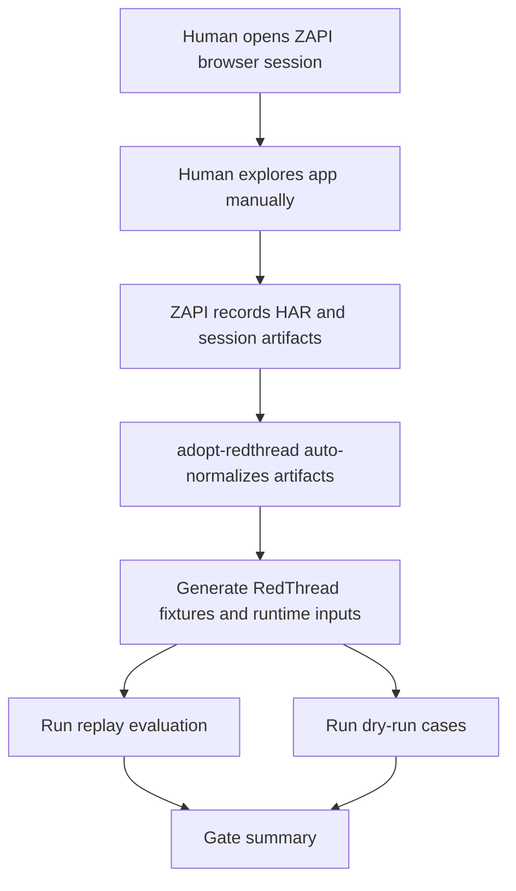
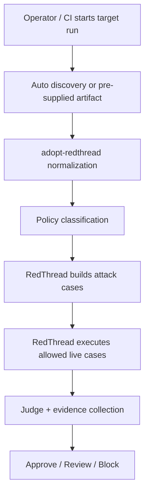
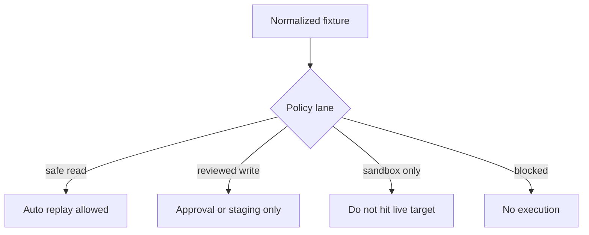
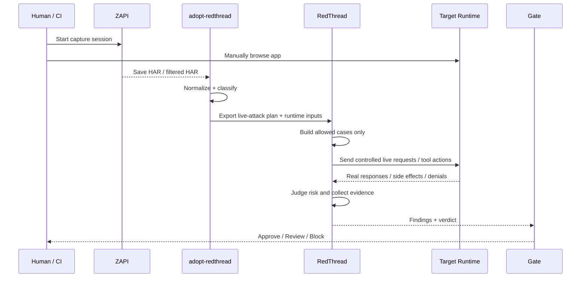
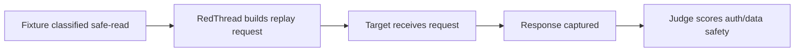
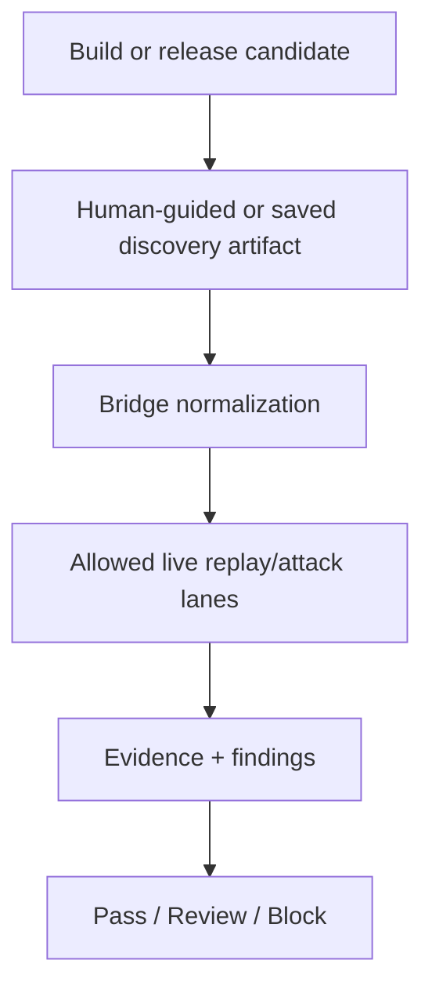

# Live Attack Implementation Plan

## Blunt answer first

Yes.
Your instinct is right.

For the ZAPI part, we should keep **human-in-the-loop discovery** as the main near-term path.

That means:
- a human opens the site
- a human clicks around
- a human logs in if needed
- a human reaches the important workflows
- ZAPI records the real session
- then the rest becomes automated

This is the correct shape.

Why:
- real apps are messy
- login flows are messy
- auth, CAPTCHA, MFA, weird redirects, popups, and app-specific flows are messy
- a human can reach the meaningful parts faster than brittle auto-browse logic
- the security value starts **after** we have a good artifact

So the near-term architecture should be:

```text
human-guided discovery -> artifact export -> automated normalization -> automated RedThread replay/dry-run -> later automated live attack lane
```

---

## Main product shape

There should be **2 operating modes**.

## Mode A — Human-guided discovery, automated security pipeline

This should be the default.



This is the best first real workflow because:
- it is believable
- it is stable
- it handles auth-heavy apps
- it gives real app-specific traffic
- it does not depend on fake browsing heuristics

## Mode B — Future automated discovery and live attack loop

This is later.



This is stronger, but riskier and harder.

So the roadmap should go through Mode A first.

---

## The real future workflow

## Stage 1 — Human discovery

Human does:
- start ZAPI session
- browse the app
- log in
- click important flows
- trigger meaningful tools/actions
- end session

ZAPI does:
- capture browser traffic
- save HAR
- optionally save filtered HAR
- optionally save extracted endpoint/action metadata

### Important design rule

The system must **not require automated browsing** to be useful.

Human-guided capture is not a fallback.
It is a first-class workflow.

---

## Stage 2 — Bridge automation

After artifact exists, `adopt-redthread` should do this automatically:

1. detect artifact type
   - HAR
   - filtered HAR
   - NoUI manifest/tools
   - Adopt action catalog

2. normalize into one fixture model
   - endpoint/tool/action name
   - method
   - path
   - auth hints
   - workflow group
   - sensitivity
   - candidate attack types

3. classify policy lane
   - safe read
   - reviewed write
   - sandbox only
   - blocked

4. export RedThread inputs
   - replay bundle
   - dry-run campaign cases
   - later live-attack execution plan

This is mostly where we already are.

---

## Stage 3 — Safe automated execution

Before full live attack mode, we need a middle layer.



This is where RedThread starts sending controlled requests automatically.

Examples:
- safe GET replay
- low-risk POST replay in staging
- session-aware request replay with explicit approval

This is the first real live execution step.

---

## Stage 4 — Full live attack lane

Later, after policy and controls are solid:



Important:
- human interaction is still at the front of the flow
- automation starts after the artifact is captured
- later we can add optional automatic discovery helpers, but they are not the foundation

---

## What gets automated vs what stays human

## Human-owned for now

These should stay human-first in the near term:
- login
- MFA handling
- weird app navigation
- deciding which workflows matter
- exercising nuanced UI flows
- choosing when capture is complete
- approving risky live execution lanes

## Automated now

These can be automated now or very soon:
- selecting downstream HAR file
- ingesting artifact
- normalization
- replay-plan generation
- gate artifact generation
- RedThread runtime export
- replay evaluation
- dry-run execution
- final summary emission

## Automated later

These should come after control gates are solid:
- safe read replay against live target
- approved write replay in staging
- multi-step live workflow execution
- session-aware live testing
- pre-publish attack gate in CI

---

## Exact roadmap

## Phase 1 — Human-guided ZAPI capture becomes official path

Goal:
make the manual capture flow the clean supported workflow.

Deliverables:
- document `demo.py` or a wrapper as **manual exploration mode**
- support a simple command like:

```bash
python3 scripts/run_live_zapi_bridge.py \
  "https://target-app.example" \
  runs/live_session \
  --interactive
```

Expected behavior:
- open browser
- human explores app
- human presses ENTER when done or clicks stop
- HAR saved
- filtered HAR selected
- pipeline continues automatically

Success criteria:
- human can tinker freely
- no forced auto-browse logic
- artifacts go straight into bridge pipeline

---

## Phase 2 — Explicit policy model for live execution

Goal:
make sure discovered surfaces are not all treated the same.

Need new or expanded fields in normalized fixtures / execution plan:
- `execution_mode`: `artifact_only | replay_only | live_allowed`
- `approval_mode`: `auto | human_review | sandbox_only | blocked`
- `target_env`: `sandbox | staging | production_like`
- `auth_context_required`: bool
- `max_replay_attempts`
- `side_effect_risk`: `low | medium | high`

Success criteria:
- every fixture gets one execution lane
- no blind live execution
- policy is machine-readable and auditable

---

## Phase 3 — Safe read replay lane

Goal:
prove real end-to-end live execution with the least risk.

Scope:
- GET and clearly non-destructive read operations only
- optional authenticated reads if operator approves
- record request/response metadata for judging

Flow:



Success criteria:
- RedThread can execute safe live reads from discovered artifacts
- evidence is saved
- policy blocks anything outside allowed lane

---

## Phase 4 — Reviewed write lane in staging

Goal:
expand from reads into controlled writes without becoming reckless.

Scope:
- staging or sandbox first
- explicit approval required
- only low/medium-risk write endpoints
- strict rate / count limits

Examples:
- set preferences
- create draft
- save search
- non-billing profile update

Not yet:
- destructive admin actions
- billing mutations
- account deletion

Success criteria:
- reviewed writes can run in safe environment
- side effects are tracked
- operator can inspect exact executed case list

---

## Phase 5 — Multi-step workflow execution

Goal:
attack flows, not just single endpoints.

Examples:
- search -> detail -> save
- login -> fetch profile -> update preference
- retrieve memory -> generate follow-up action

Need:
- workflow grouping from HAR/tool traces
- session reuse
- step-by-step evidence capture
- stop-on-failure behavior

Success criteria:
- RedThread can replay a discovered workflow chain
- evidence is attached per step
- unsafe branches are pruned by policy

---

## Phase 6 — Session-aware live attack lane

Goal:
test real permission boundaries and agent/tool misuse more honestly.

Need:
- cookie/header/session handling model
- explicit auth source tracking
- expiry handling
- strong masking for secrets in logs
- proof of which identity was used during attack

Success criteria:
- operator knows exactly which auth context was used
- RedThread can test permission errors and confused-deputy paths
- logs do not leak secrets

---

## Phase 7 — Pre-publish gate

Goal:
turn this into a release control.



Success criteria:
- one final machine-readable summary
- policy-controlled execution
- clear failure reasons
- easy operator review

---

## Needed implementation pieces

## In `adopt-redthread`

### A. Interactive capture mode

Need runner behavior like:
- `--interactive`
- maybe `--duration-seconds` for timed mode
- maybe `--manual-confirm-har` if both raw and filtered HAR exist

This is mostly orchestration glue.

### B. Live execution plan artifact

Need a generated file like:
- `live_attack_plan.json`

Example shape:

```json
{
  "mode": "human_guided_then_automated",
  "target_env": "staging",
  "fixtures": [
    {
      "fixture_id": "get_user_profile",
      "execution_mode": "live_allowed",
      "approval_mode": "auto",
      "side_effect_risk": "low"
    },
    {
      "fixture_id": "set_user_preference",
      "execution_mode": "live_allowed",
      "approval_mode": "human_review",
      "side_effect_risk": "medium"
    },
    {
      "fixture_id": "delete_account",
      "execution_mode": "artifact_only",
      "approval_mode": "sandbox_only",
      "side_effect_risk": "high"
    }
  ]
}
```

### C. Final gate summary

Need one summary artifact that combines:
- replay verdict
- dry-run verdict
- live execution verdict
- blocked items
- reviewed items
- skipped items

---

## In RedThread

Near term, RedThread should receive:
- normalized fixture
- execution lane
- auth context metadata
- environment target info

Then RedThread should do:
- build request/tool action cases
- execute only allowed lanes
- collect evidence
- score outcome
- emit gate-ready results

Important boundary:
- `adopt-redthread` decides **what the app surface looks like**
- RedThread decides **how to attack and evaluate that surface**

---

## The one sentence plan

The real plan is:

> **Keep human-guided ZAPI discovery in front, then automate normalization, replay, dry-run, and later policy-controlled live execution behind it.**

That is the clean path.

Not:
- fake full automation too early
- remove the human from discovery
- blindly execute every discovered request

---

## Recommended next implementation order

1. make **interactive human-guided capture** the official path in the live runner
2. add **execution-lane policy fields** to normalized fixtures / execution plan
3. add **safe-read live replay** first
4. add **reviewed writes in staging**
5. add **workflow replay**
6. add **session-aware live execution**
7. add **final publish gate**

That is the order that makes this believable and safe.
