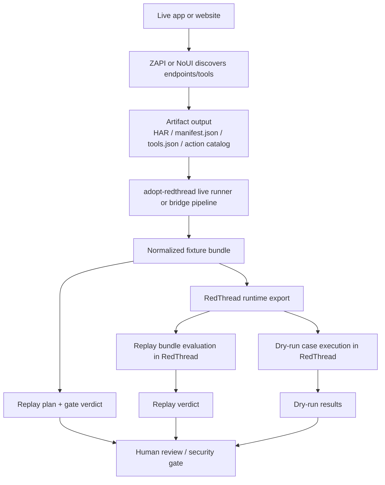
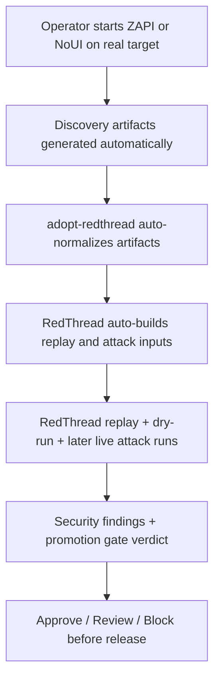

# Live Workflow Explained

## Short answer

Is our live run working?

**Partly yes. Fully no.**

What works today:
- we can take **real discovery artifacts** from ZAPI or NoUI
- we can normalize them into the bridge format
- we can export them into **real RedThread replay inputs**
- we can run **real RedThread replay evaluation**
- we can run **real RedThread dry-run cases**
- we can run that bridge chain from **one command**
- we can use a **live ZAPI capture runner** that saves HAR and feeds the selected HAR into the bridge automatically
- we now have an explicit **interactive human-guided capture mode** with saved capture metadata
- we now generate a **machine-readable live attack plan** and can execute the first **policy-gated live safe-read GET lane**
- we can now execute reviewed **auth-bound safe-read GETs** only when explicit approved auth context is supplied
- we can now execute the first **reviewed non-destructive staging write lane** only when explicit approved write context is supplied
- we can now execute the first **grouped sequential workflow replay lane** for multi-step cases with stop-on-first-failure behavior

What does **not** work yet:
- one-button fully live flow from **running ZAPI session -> automatic RedThread attack loop -> live target execution**
- direct live pull from Adopt services
- full production-grade publish gate
- full live attack execution against a real Adopt-managed runtime/session
- full session-aware authenticated replay beyond approved header reuse
- broader reviewed write coverage beyond the first non-destructive staging lane
- richer workflow state beyond grouped sequential replay

So the honest status is:

> **The bridge is real. The RedThread handoff is real. The full live runtime loop is not finished yet.**

---

## In simple terms

Think of the system like this:

- **ZAPI / NoUI** = tools that look at the app and discover what operations exist
- **adopt-redthread** = translator bridge
- **RedThread** = security engine that judges, replays, and stress-tests those operations

Today, the workflow is:

1. run a discovery tool
2. get app artifacts out of it
3. convert those artifacts into RedThread-friendly fixtures
4. export those fixtures into RedThread runtime inputs
5. let RedThread evaluate and dry-run them
6. optionally do that entire chain from one top-level command

That part works.

The missing part is the final jump to a fully live loop where RedThread is automatically driving a real target session discovered by ZAPI in a production-like flow.

---

## What “working” means right now

## 1. ZAPI side

We **did** get real ZAPI output artifacts.

We inspected and used:
- `demo_session_filtered.har`
- `demo_session.har`

We built a real HAR ingestion path for them.

That means:
- real browser/session capture output from ZAPI can be consumed
- noisy traffic can be filtered down to app-relevant endpoints
- those endpoints can become RedThread fixtures

But this is still **artifact-level handoff**, not full live orchestration.

### Important truth

The local ZAPI demo itself had a rough edge:
- `demo.py` used a hardcoded `DEMO_URL = "<INSERT_URL_HERE>"`
- passing a URL on the CLI did not work unless the script was changed

So the old `demo.py` path was not a polished one-command pipeline.

That is why `adopt-redthread` now has its own live runner that takes a real URL, captures HAR, selects the downstream HAR, and then launches the bridge pipeline.

---

## 2. Bridge side (`adopt-redthread`)

This part **is working well**.

It can now ingest:
- ZAPI catalog-style discovery
- ZAPI HAR-style discovery
- NoUI MCP server output
- Adopt action catalogs

It can then convert those into one common shape:
- normalized RedThread fixtures

That common shape is the key.

Because of that, RedThread does not need to understand every Adopt artifact directly.
The bridge does the translation.

---

## 3. RedThread side

This part is **real**, but still limited in scope.

Today the bridge can hand off into two real RedThread seams:

### A. Replay evaluation

The bridge builds a RedThread-style replay bundle.
Then RedThread evaluates it with real promotion-gate code.

This is real working integration.

### B. Dry-run engine execution

The bridge builds dry-run campaign cases.
Then RedThread runs one through its dry-run engine path.

This is also real working integration.

### But not yet

What we do **not** have yet:
- RedThread fully driving a live target discovered moments earlier by ZAPI
- RedThread doing live authenticated attack execution against a real Adopt-managed runtime
- broader reviewed write lanes beyond the first staging slice
- full continuous closed-loop publish gating

---

## Current workflow diagram

---

## How the workflow is supposed to act

## Goal behavior

The intended workflow is:

1. **Discovery happens first**
   - ZAPI or NoUI watches the app
   - human-guided ZAPI capture is the preferred near-term path
   - it finds APIs, tools, actions, auth patterns, and workflow hints

2. **Bridge normalizes the findings**
   - convert discovery artifacts into one shared fixture model
   - classify risk
   - mark read/write/destructive/auth-sensitive surfaces

3. **RedThread receives clean inputs**
   - RedThread should not care whether the source was ZAPI, HAR, NoUI, or action catalog
   - it should only care about the normalized target description

4. **RedThread evaluates and attacks safely**
   - replay known flows
   - dry-run generated cases
   - later, attack richer live workflows

5. **Gate decision happens at the end**
   - approve
   - review
   - block

That is the intended product behavior.

---

## The ideal future workflow

This is where we want to go.

For the concrete implementation path, see also:
- `docs/full-live-loop-diagram.md`
- `docs/live-attack-implementation-plan.md`

---

## Where we are now vs where we want to be

## Today

We have:
- real discovery artifacts
- real normalization
- real RedThread replay evaluation
- real RedThread dry-run execution
- prototype gate outputs
- a one-command artifact pipeline
- a one-command live ZAPI capture runner

So this is already more than mock architecture.

## Still missing

We still need:
- richer RedThread execution beyond replay + one dry-run lane
- production-style CI/publish gate wiring
- deeper live execution beyond capture -> replay/dry-run
- full automatic live attack execution against the discovered target

---

## Simple status table

| Part | Status | Truth |
|---|---|---|
| ZAPI artifact ingestion | Working | Real HAR outputs can be consumed |
| NoUI artifact ingestion | Working | First real MCP manifest/tools shape supported |
| Bridge normalization | Working | One shared fixture model exists |
| RedThread replay evaluation | Working | Uses real RedThread code |
| RedThread dry-run handoff | Working | Uses real RedThread engine path |
| One-command live ZAPI capture -> bridge -> replay/dry-run | Working | New runner exists in `scripts/run_live_zapi_bridge.py` |
| Full live ZAPI -> RedThread auto-loop | Not done | Still prototype gap |
| Live attack execution on real Adopt runtime | Not done | Future step |
| Production publish gate | Not done | Future step |

---

## Best honest summary

If you ask:

> "Can we run ZAPI, get insights, and make RedThread work on that?"

The answer is:

**Yes, if “get insights” means discovery artifacts feeding RedThread replay and dry-run seams.**

If you mean:

**"Can we run one fully live automatic pipeline from ZAPI browser runtime straight into live RedThread attack execution on the target?"**

Then the answer is:

**Not yet.**

---

## Best next step

The latest milestone closed the first automation gap:

1. run ZAPI live with a reliable wrapper
2. automatically ingest the produced HAR/artifact into `adopt-redthread`
3. automatically export RedThread runtime inputs
4. run replay + dry-run from one command

The next step now is different:

1. move from replay + one dry-run case toward richer multi-case execution
2. add CI/publish-gate wiring
3. extend from bridge automation into deeper live execution

That is the shortest path from prototype bridge to believable live workflow.
